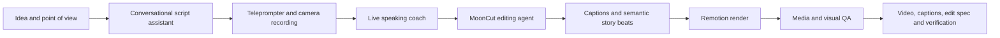
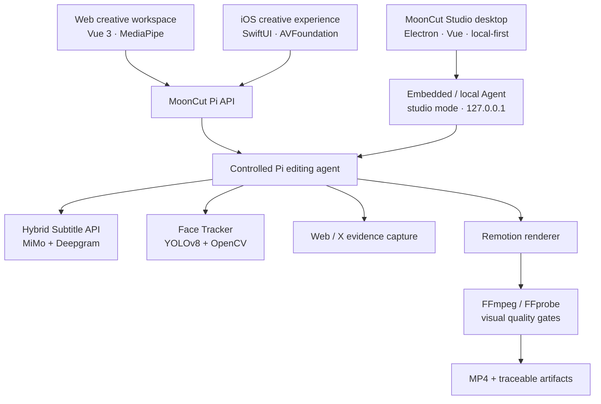

<p align="center">
  
</p>

<h1 align="center">MoonCut</h1>

<p align="center">
  <strong>Turn one idea into a talking-head video worth publishing.</strong><br />
  An AI speaking-video studio — from thinking and scripting to teleprompted recording and verified delivery.
</p>

<p align="center">
  <a href="https://mooncut.me"><strong>Visit the live product · mooncut.me ↗</strong></a> ·
  <a href="https://mooncut.me">Start creating online</a> ·
  <a href="./mooncut-studio/README.md">Explore the desktop Studio</a> ·
  <a href="./LICENSE">Apache-2.0</a>
</p>

<p align="center">
  <a href="./README.md">简体中文</a> ·
  <a href="./README.en.md">English</a> ·
  <a href="./README.ja.md">日本語</a> ·
  <a href="./README.ko.md">한국어</a> ·
  <a href="./README.es.md">Español</a>
</p>

<p align="center">
  
  
  
</p>

> **In one line:** MoonCut turns talking-head creation into a deliberate, inspectable path: clarify the message, record with confidence, then use real captions, semantic story beats, and quality gates to make the final video.

## Watch the finished videos

The original MP4 files are versioned with Git LFS. GitHub's media preview is not reliable, so the permanent web-hosted posters below open the playable showcase on mooncut.me.

| Demo | Website preview | What it shows |
| --- | --- | --- |
| **Moonshot Plan · Physical AI Hackathon, on site**<br />41 s · 1280×720 | <a href="https://mooncut.me/#works"></a><br />[▶ Play on mooncut.me ↗](https://mooncut.me/#works)<br />[Xiaohongshu field note: “The Moonshot Plan hackathon was genuinely astonishing”](http://xhslink.com/o/R8BbBY1Qe1) | A live creation example that brings together event context, real web evidence, speaker footage, and emphasized captions. |
| **Argentina vs. Egypt · World Cup match analysis**<br />97 s · 1920×1080 | <a href="https://mooncut.me/#works"></a><br />[▶ Play on mooncut.me ↗](https://mooncut.me/#works) | Combines official match highlights, an event timeline, score cards, and the presenter into a paced analysis video. |

## Who it is for

MoonCut is for people who need to show up on camera consistently but would rather not spend their energy on blank-page scripting, repeated takes, and timeline micro-edits: educators, product and brand teams, independent creators, student communities, and anyone with a point worth saying clearly.

It connects “I have something to say” with “I have a video ready to share,” while protecting the speaker's voice, framing, and natural rhythm.

## The creation path



| Moment | What the creator sees | What MoonCut does |
| --- | --- | --- |
| Think | Guided chat, topic suggestions, editable script | Organizes a topic, point of view, and tone into language that can actually be spoken. |
| Record | Teleprompter, mirror, countdown, pause/resume | Captures in the browser or native camera, then hands the take straight to editing. |
| Practice | Pace, volume, pause, and gaze prompts | Locally analyzes audio and video in real time and gives one short, actionable suggestion when useful. |
| Edit | Clear stages, progress, final preview | Produces timed captions and a semantic edit specification, then renders a coherent final piece. |
| Verify | Final video, contact sheet, QA artifacts | Checks media properties and targeted visual moments before delivery. |

## What MoonCut can do

### From conversation to a speakable script

- Guides the creator through a topic, audience, and tone, then offers three distinct content angles.
- Generates and polishes scripts in natural, short-form, or emotional modes.
- Keeps drafts, messages, and selected creative preferences on the client so work can be resumed naturally.

### Teleprompted recording and live coaching

- Brings together front-camera capture, teleprompter scrolling, mirroring, countdown, pause/resume, and take review.
- Uses browser speech recognition to follow the script, audio analysis for pace, volume, and meaningful pauses, and MediaPipe face landmarks for framing and gaze feedback.
- Falls back gracefully to a complete demo experience when a browser capability or permission is unavailable; with services connected, low-latency model advice can complement local coaching.

### AI editing designed for spoken video

- Creates an asynchronous edit job from an uploaded source, with explicit stages for inspection, transcription, speaker tracking, planning, rendering, and verification.
- Saves a `mooncut.edit.v1` semantic timeline: every beat has timing, headline, body, keywords, visual type, and speaker layout instead of opaque, one-off frame code.
- Preserves the source composition for the main speaker shot. Face tracking is limited to stable circular speaker overlays on explanatory, quote, and evidence scenes, preventing distracting camera jumps.
- Supports desktop explanation cards, key quotes, restrained full-screen impact text, original footage, and credible web evidence.

### More trustworthy captions

- Combines **MiMo** for text quality with **Deepgram Nova-3** for acoustic timing, then aligns the two.
- Normalizes long media, splits it at silence with context overlap, applies glossaries, and returns character-, word-, and caption-segment timelines.
- Delivers JSON, SRT, and WebVTT. Interpolated or uncertain ranges remain visible for review rather than being presented as perfect.

### Authentic evidence and quality gates

- When a spoken claim needs support, the agent can capture a real public webpage or a validated original X post. The untouched screenshot is used in the video rather than a lookalike card.
- FFprobe checks codec, resolution, duration, and audio, while a six-frame contact sheet makes the outcome reviewable.
- Targeted frames from impact and evidence beats pass multimodal visual review. Hard failures require a revised edit spec, re-render, and another check.

### A cross-device creative workspace

- The web experience includes a landing page, recording room, editing studio, and light, dark, and Memphis themes across desktop and mobile layouts.
- The iOS experience covers the speaking assistant, draft, teleprompted capture, playback, import, and sharing with SwiftUI, AVFoundation, and PhotosUI.
- “Xiaoyue,” the creative companion, responds to planning, recording, processing, and completion states without getting in the way of expression.

### MoonCut Studio · local professional desktop workstation

- **[MoonCut Studio](./mooncut-studio/README.md)** is the monorepo’s **full desktop Studio shell / OS-like app** (Electron + Vue) for creators who need a closed-loop workflow on their own machine.
- **No MoonCut login, no cloud identity**: projects, media, jobs, and exports stay under your chosen workspace; API keys use OS secure storage.
- Four top-level panels: **Project library → Create talk → Edit workbench → Settings** — script, teleprompter recording, live coaching, one-click edit, and diagnostics.
- Installers can embed pi-agent, Remotion, FFmpeg, caption, and face-track runtimes so end users need not check out the whole monorepo.
- Shares the same talking-head product model as Web / iOS; Studio is the **offline professional workstation**. Usage and architecture: [mooncut-studio/README.md](./mooncut-studio/README.md).

## Why MoonCut

| Product choice | What it means for creators |
| --- | --- |
| **Expression before editing** | Start with a point of view and a script, not an empty timeline. |
| **Real timing** | Captions, keywords, and impact animation align to the actual spoken timeline. |
| **Original framing stays intact** | Tracking supports small overlays instead of continuously reframing the main camera. |
| **Traceable outputs** | A finished video comes with its edit spec, captions, face track, contact sheets, render log, and verification. |
| **Evidence, not imitation** | Official pages and posts appear as captured source material. |
| **Honest fallback behavior** | If captions, tracking, or vision are unavailable, MoonCut degrades visibly instead of inventing a result. |

## How the product is composed



| Layer | Technology and dependency | Product responsibility |
| --- | --- | --- |
| Creative UI | Vue 3, TypeScript, Vite, MediaPipe Tasks Vision | Scripting, recording, live coaching, job state, and local demo. |
| **Desktop Studio** | Electron, Vue 3, IPC allowlist, bundled runtime | Login-free local project library, create-talk, edit workbench, settings. See [mooncut-studio](./mooncut-studio/README.md). |
| Native mobile | SwiftUI, AVFoundation, AVKit, PhotosUI | iPhone camera, teleprompter, playback, import, and sharing. |
| Agent orchestration | Node.js, TypeScript, `@earendil-works/pi` SDK, OpenAI-compatible model gateway | Keeps inspection, transcription, planning, rendering, and verification in a controlled order. |
| Captions | Python, FastAPI, MiMo, Deepgram, FFmpeg, jieba | Merges textual accuracy with word-level acoustic timing. |
| Speaker processing | Python, Ultralytics YOLOv8, OpenCV, LAP | Locks onto the primary speaker and emits reusable normalized tracks. |
| Render and verification | React, Remotion, FFmpeg, FFprobe | Renders the semantic timeline and performs media and visual QA. |

The default model routing is configurable: GLM for planning and scripts, DeepSeek Flash for live coaching, MiniMax M3 for vision checks, and MiMo v2.5 as a vision fallback. Model names and gateways are configuration, not hard-coded product logic.

## Interfaces, CLIs, and Skills

MoonCut is more than a set of screens. Reusable production work is packaged into product-facing APIs, commands, and agent skills.

### Product API

The `MoonCut Pi Video Editor API` exposes asset upload, asynchronous edit jobs, job state, artifact download, script assistance, live coaching, and a “prepare then confirm” completion-email flow. A completed job can yield:

`video` · `editSpec` · `subtitles` · `faceTrack` · `sourceInspection` · `sourceContactSheet` · `finalContactSheet` · `verification` · `renderProps` · `renderLog` · `piEvents` · `agentSummary`

### Packaged CLIs

| Command / entry point | Purpose | Output |
| --- | --- | --- |
| Pi package `serve` / `edit` / `models` entries | Run the local service, process a real source video, or reveal model routing | Job API, final video, and complete task artifacts. |
| `mooncut-face-track analyze` | Finds and stabilizes the primary speaker | `mooncut.face-track.v1` JSON. |
| `mooncut-face-track render` / `run` | Reframes an existing track for portrait, square, landscape, or circular preview | Preview video and track. |
| Remotion `render` / `transcribe` / `materials:*` | Renders examples, makes captions, and maintains the searchable visual-material library | Reproducible media and material indexes. |
| `wc26` | Finds official FIFA highlights, Chinese match pages, and browser screenshots | An independent source-material utility useful for demonstrating real web evidence; not a core MoonCut end-user feature. |

### Embedded Pi Skills

| Skill | Constraint and value |
| --- | --- |
| `mooncut-editor` | Enforces the production loop: inspect → caption → track → specify → render → verify. |
| `browser-evidence` | Captures real public pages and accessibility snapshots for use as primary visual evidence. |
| `x-post-evidence` | Finds and saves untouched X-post screenshots under an explicit trusted-account allowlist. |

The agent has eight controlled tools only: inspect, transcribe, track, capture web evidence, capture X evidence, save the edit spec, render, and verify. It has no arbitrary shell access, keeping model-driven production inside an auditable boundary.

## Repository map

| Directory | Product role |
| --- | --- |
| [`mooncut-studio`](./mooncut-studio/README.md) | **Desktop Studio shell / local professional workstation** (Electron): project library, create-talk, edit workbench, settings; optional full production runtime bundle. See [Studio README](./mooncut-studio/README.md). |
| [`mooncut-web`](./mooncut-web) | Browser creative workspace and product landing page. |
| [`ios`](./ios) | Native iPhone experience and product screenshots. |
| [`mooncut-pi-agent`](./mooncut-pi-agent) | Editing agent, HTTP interface, job queue, quality gates, and Pi Skills. |
| [`hybrid-subtitle-service`](./hybrid-subtitle-service) | Independently deployable asynchronous hybrid-caption API. |
| [`face-tracker`](./face-tracker) | Primary-speaker tracking, stabilization, reframing, and CLI. |
| [`remotion-studio`](./remotion-studio) | Data-driven video compositions, captions, assets, and rendering. |
| [`docs`](./docs) | Product constraints for visual speaker tracking. |
| [`information-bases`](./information-bases) | Product research around device integration, background music, and related decisions. |

## MoonCut Studio (desktop entry)

For a **local closed loop, no login, packable installer** talking-head workstation, start here:

**→ [mooncut-studio/README.md](./mooncut-studio/README.md)** (what Studio is, how to use the panels, dev/pack, privacy and architecture)

| | Studio | Web | iOS |
| --- | --- | --- | --- |
| Form | Desktop app | Browser | iPhone app |
| Login | Not required | Optional | Optional |
| Default data | Local project folders | Browser / optional remote agent | On-device |
| Full edit runtime | Can ship inside the installer | Depends on external services | Needs service connection |

```bash
cd mooncut-studio
npm install && npm run build && npm run dev
```

## Current product state and data boundary

The repository intentionally contains both a **production pipeline that can connect to real services** and a **local demo interface that makes the experience easy to explore**. They should not be conflated:

- The web workspace can demonstrate the creation flow without a service. With the Pi API connected, it uploads assets and exposes actual job progress and artifacts.
- The iOS app currently presents native interaction and local state-machine behavior. Its smart editing, captions, and final-export preview are demo implementations and are not yet connected to AI or rendering services.
- **MoonCut Studio** is local-first and login-free by default; it can embed a real Agent runtime. Remote models are used only after the user enables and configures them in Settings; keys never enter project files. See [Studio privacy](./mooncut-studio/docs/PRIVACY.md).
- In real editing mode, the source first reaches the configured local agent; audio may be sent to the configured MiMo and Deepgram caption providers, and contact sheets may be sent to the configured vision-model gateway. A production deployment should clearly disclose data flow, retention, and deletion controls.
- Email notifications are a two-step “prepare → user confirms → send” action, so task completion cannot send an email silently (Studio baseline has no mail sending).

---

<p align="center">
  <strong>Less editing friction. More room to express.</strong><br />
  MoonCut — Speak naturally. Ship confidently.
</p>
