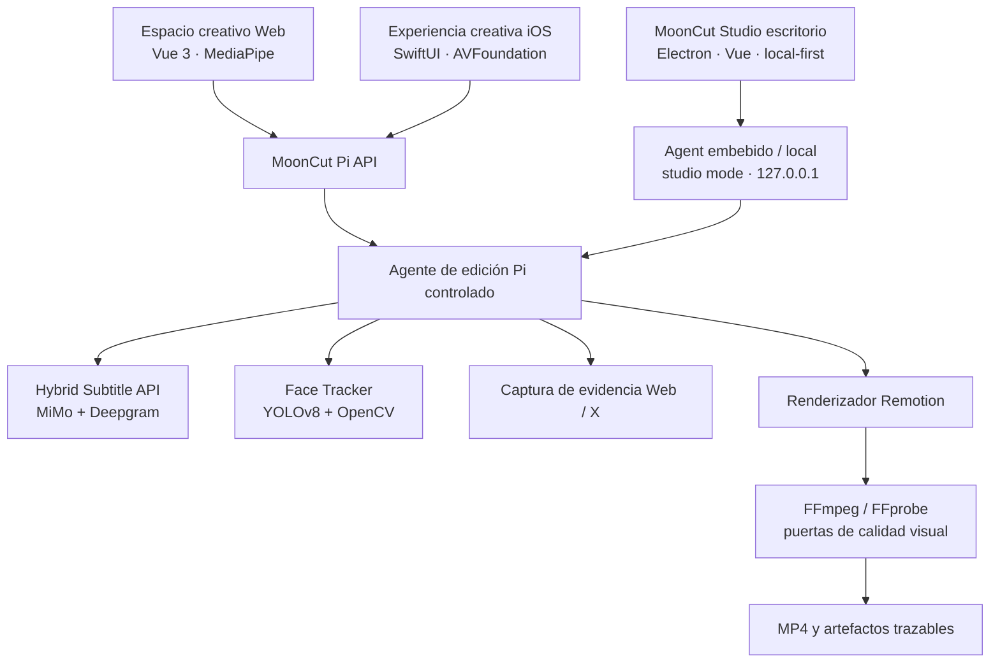

<p align="center">
  
</p>

<h1 align="center">MoonCut</h1>

<p align="center">
  <strong>Convierte una idea en un vídeo hablando que da ganas de publicar.</strong><br />
  Un estudio de vídeo hablado con IA: desde la idea y el guion hasta la grabación con teleprónter y la entrega verificada.
</p>

<p align="center">
  <a href="./README.md">简体中文</a> ·
  <a href="./README.en.md">English</a> ·
  <a href="./README.ja.md">日本語</a> ·
  <a href="./README.ko.md">한국어</a> ·
  <a href="./README.es.md">Español</a>
</p>

<p align="center">
  
  
  
</p>

> **En una frase:** MoonCut no arroja un vídeo a una caja negra. Convierte la creación de vídeos hablados en una ruta controlable: aclarar el mensaje, grabar con confianza y terminar con subtítulos reales, planos semánticos y puertas de calidad.

## Ver los vídeos terminados

Las dos demostraciones siguientes están incluidas en este repositorio como medios Git LFS y se pueden abrir o descargar directamente.

| Demo | Vídeo terminado | Qué demuestra |
| --- | --- | --- |
| **Moonshot Plan · Hackathon de Physical AI, en directo**<br />41 s · 1280×720 | [▶ Ver el MP4](./remotion-studio/out/moonshot-gpt56-horizontal-v2-xhs.mp4)<br />[Crónica en Xiaohongshu: «El hackathon Moonshot Plan fue realmente impresionante»](http://xhslink.com/o/R8BbBY1Qe1) | Un ejemplo de creación en vivo que une contexto del evento, evidencia web real, vídeo del presentador y subtítulos enfatizados. |
| **Argentina vs. Egipto · Análisis de partido del Mundial**<br />97 s · 1920×1080 | [▶ Ver el MP4](./remotion-studio/out/argentina-egypt-analysis-v2.mp4) | Combina resúmenes oficiales, línea de tiempo de eventos, tarjetas de marcador y presentador en un vídeo de análisis con ritmo. |

## Para quién es

MoonCut está pensado para quienes necesitan aparecer ante la cámara con frecuencia, pero no quieren gastar su energía en escribir desde cero, repetir tomas y ajustar una línea de tiempo al milímetro: divulgadores, equipos de producto y marca, creadores independientes, comunidades estudiantiles y cualquiera que quiera expresar una idea con claridad.

Une “tengo algo que decir” con “tengo un vídeo listo para compartir”, sin borrar la voz, el encuadre ni el ritmo natural de quien habla.

## El recorrido creativo

```mermaid
flowchart LR
  A[Idea y punto de vista] --> B[Asistente conversacional de guion]
  B --> C[Teleprónter y grabación con cámara]
  C --> D[Coach de expresión en directo]
  D --> E[Agente de edición MoonCut]
  E --> F[Subtítulos y planos semánticos]
  F --> G[Renderizado con Remotion]
  G --> H[QA de medios y visual]
  H --> I[Vídeo, subtítulos, especificación y verificación]
```



| Momento | Lo que ve el creador | Lo que hace MoonCut |
| --- | --- | --- |
| Pensar | Chat guiado, propuestas de tema, guion editable | Organiza tema, punto de vista y tono en frases que sí se pueden decir. |
| Grabar | Teleprónter, espejo, cuenta atrás, pausa/reanudar | Captura en navegador o cámara nativa y entrega la toma directamente a edición. |
| Practicar | Indicaciones de ritmo, volumen, pausas y mirada | Analiza audio y vídeo localmente en tiempo real y ofrece una recomendación breve cuando ayuda. |
| Editar | Etapas claras, progreso, previsualización final | Produce subtítulos temporizados y una especificación de edición semántica, y renderiza el resultado. |
| Verificar | Vídeo final, hoja de contactos, artefactos de QA | Comprueba propiedades del medio y momentos visuales clave antes de entregar. |

## Capacidades del producto

### De una conversación a un guion que se puede decir

- Guía al creador por tema, audiencia y tono, y ofrece tres enfoques de contenido distintos.
- Genera y pule guiones en modos de habla natural, formato corto o expresión emocional.
- Conserva borradores, mensajes y preferencias de creación seleccionadas en el cliente para retomar el trabajo con naturalidad.

### Grabación con teleprónter y coaching en directo

- Reúne cámara frontal, desplazamiento del teleprónter, espejo, cuenta atrás, pausa/reanudar y revisión de toma en un único flujo.
- Usa reconocimiento de voz del navegador para seguir el guion, análisis de audio para ritmo, volumen y pausas útiles, y puntos faciales de MediaPipe para encuadre y feedback de mirada.
- Si falta una función del navegador o un permiso, cambia de forma segura a una experiencia de demostración completa. Con servicios conectados, un modelo de baja latencia puede complementar los consejos locales.

### Edición con IA para vídeo hablado

- Crea un trabajo de edición asíncrono a partir de un vídeo subido y muestra etapas explícitas de inspección, transcripción, seguimiento de la persona, planificación, renderizado y verificación.
- Guarda una línea de tiempo semántica `mooncut.edit.v1`: cada bloque tiene tiempo, titular, cuerpo, palabras clave, tipo visual y disposición de la persona, en lugar de código opaco de fotogramas de un solo uso.
- Conserva el encuadre original en el plano principal. El seguimiento facial se limita a una burbuja circular estable en escenas explicativas, de cita y de evidencia, evitando saltos de cámara.
- Admite tarjetas de explicación tipo escritorio, citas clave, texto de impacto moderado, metraje original y evidencia web fiable.

### Subtítulos fiables y puertas de calidad

- Combina la calidad de texto de **MiMo** con los tiempos acústicos de **Deepgram Nova-3**, y después los alinea.
- Normaliza medios largos, los divide en silencios conservando contexto, aplica glosarios y devuelve líneas temporales de caracteres, palabras y segmentos de subtítulo.
- Entrega JSON, SRT y WebVTT; las zonas interpoladas o inciertas siguen siendo visibles para revisión.
- Cuando una afirmación hablada necesita respaldo, puede utilizar una página pública real o una publicación original de X validada, sin redibujar una tarjeta de imitación.
- FFprobe revisa códec, resolución, duración y audio. Una hoja de contactos y revisiones multimodales de fotogramas clave controlan el resultado; un fallo grave exige revisar el plano y volver a renderizar.

### Un espacio creativo multidispositivo

- La web incluye landing page, sala de grabación y estudio de edición, con temas claro, oscuro y Memphis para escritorio y móvil.
- La experiencia iOS cubre asistente de expresión, guion, grabación con teleprónter, reproducción, importación y compartir con SwiftUI, AVFoundation y PhotosUI.
- La compañera creativa “Xiaoyue” responde a los estados de ideación, grabación, procesamiento y finalización sin interrumpir la expresión.

### MoonCut Studio · estación de trabajo de escritorio local

- **[MoonCut Studio](./mooncut-studio/README.md)** es el **shell Studio de escritorio / app tipo sistema** del monorepo (Electron + Vue) para quien necesita un flujo cerrado en su máquina.
- **Sin login ni identidad en la nube**: proyectos, medios, trabajos y exportaciones quedan en el directorio de trabajo elegido; las claves usan el almacén seguro del SO.
- Cuatro paneles: **Biblioteca de proyectos → Crear locución → Mesa de edición → Ajustes**.
- El instalador puede empaquetar pi-agent, Remotion, FFmpeg, subtítulos y seguimiento facial. Uso y arquitectura: [mooncut-studio/README.md](./mooncut-studio/README.md).

## Por qué MoonCut

| Decisión de producto | Lo que significa para el creador |
| --- | --- |
| **Expresión antes que edición** | El trabajo comienza con un punto de vista y un guion, no con una línea de tiempo vacía. |
| **Tiempo real** | Subtítulos, palabras clave y animaciones de impacto se alinean con la locución real. |
| **El encuadre original permanece** | El seguimiento sirve a pequeñas superposiciones y no reencuadra continuamente la cámara principal. |
| **Resultados trazables** | Junto al vídeo quedan la especificación, subtítulos, pista facial, hojas de contacto, registro y verificación. |
| **Evidencia, no imitación** | Páginas y publicaciones oficiales aparecen como material de origen capturado. |

## Cómo está compuesto el producto



| Capa | Tecnología y dependencia | Responsabilidad de producto |
| --- | --- | --- |
| UI creativa | Vue 3, TypeScript, Vite, MediaPipe Tasks Vision | Guion, grabación, coaching en directo, estado de trabajo y demo local. |
| **Studio de escritorio** | Electron, Vue 3, lista blanca IPC, runtime empaquetado | Biblioteca local sin login, crear locución, mesa de edición y ajustes. Ver [mooncut-studio](./mooncut-studio/README.md). |
| Móvil nativo | SwiftUI, AVFoundation, AVKit, PhotosUI | Cámara de iPhone, teleprónter, reproducción, importación y compartir. |
| Orquestación de agente | Node.js, TypeScript, SDK `@earendil-works/pi`, gateway de modelos compatible con OpenAI | Mantiene inspección, transcripción, planificación, renderizado y verificación en un orden controlado. |
| Subtítulos | Python, FastAPI, MiMo, Deepgram, FFmpeg, jieba | Une precisión textual y temporización acústica por palabra. |
| Procesamiento de persona | Python, Ultralytics YOLOv8, OpenCV, LAP | Fija al hablante principal y produce pistas normalizadas reutilizables. |
| Render y verificación | React, Remotion, FFmpeg, FFprobe | Renderiza la línea de tiempo semántica y realiza QA de medios y visual. |

El enrutamiento de modelos por defecto es configurable: GLM para planificación y guiones, DeepSeek Flash para coaching en directo, MiniMax M3 para comprobaciones visuales y MiMo v2.5 como respaldo visual. Los nombres de modelos y el gateway no están fijados en la lógica del producto.

## Interfaces, CLI y Skills

`MoonCut Pi Video Editor API` expone carga de material, trabajos asíncronos, estado, descarga de artefactos, asistencia de guion, coaching en directo y un flujo de correo de finalización “preparar y confirmar”. Un trabajo completado puede entregar:

`video` · `editSpec` · `subtitles` · `faceTrack` · `sourceInspection` · `sourceContactSheet` · `finalContactSheet` · `verification` · `renderProps` · `renderLog` · `piEvents` · `agentSummary`

| Comando / Skill | Propósito |
| --- | --- |
| Entradas `serve` / `edit` / `models` del paquete Pi | Ejecutar el servicio local, procesar un vídeo real y ver el enrutamiento de modelos. |
| `mooncut-face-track analyze` / `render` / `run` | Analizar, estabilizar y reencuadrar al hablante principal para vistas vertical, cuadrada, horizontal o circular. |
| `render` / `transcribe` / `materials:*` de Remotion | Renderizar vídeos, generar subtítulos y mantener la biblioteca visual buscable. |
| `wc26` | Herramienta independiente para encontrar resúmenes oficiales de FIFA, páginas de partidos en chino y capturas de navegador; no es una función principal para usuarios de MoonCut. |
| `mooncut-editor` | Impone el ciclo de producción: inspeccionar → subtitular → seguir → especificar → renderizar → verificar. |
| `browser-evidence` | Captura páginas públicas reales y snapshots de accesibilidad como evidencia visual primaria. |
| `x-post-evidence` | Guarda capturas sin modificar de publicaciones de X bajo una lista explícita de cuentas de confianza. |

El agente de edición sólo tiene ocho herramientas controladas: inspeccionar, transcribir, seguir, capturar evidencia web, capturar evidencia de X, guardar la especificación, renderizar y verificar. No tiene acceso arbitrario a shell, manteniendo la producción guiada por modelos dentro de un límite auditable.

## Mapa del repositorio

| Directorio | Papel en el producto |
| --- | --- |
| [`mooncut-studio`](./mooncut-studio/README.md) | **Shell Studio de escritorio / estación local profesional** (Electron). Ver [Studio README](./mooncut-studio/README.md). |
| [`mooncut-web`](./mooncut-web) | Espacio creativo en navegador y landing page. |
| [`ios`](./ios) | Experiencia nativa para iPhone y capturas de producto. |
| [`mooncut-pi-agent`](./mooncut-pi-agent) | Agente de edición, API HTTP, cola de trabajos, puertas de calidad y Pi Skills. |
| [`hybrid-subtitle-service`](./hybrid-subtitle-service) | API asíncrona de subtítulos híbridos desplegable de forma independiente. |
| [`face-tracker`](./face-tracker) | Seguimiento, estabilización, reencuadre y CLI del hablante principal. |
| [`remotion-studio`](./remotion-studio) | Composiciones de vídeo, subtítulos, recursos y renderizado basados en datos. |
| [`docs`](./docs) | Restricciones de producto para seguimiento visual del hablante. |
| [`information-bases`](./information-bases) | Investigación de producto sobre integración de dispositivos, música de fondo y decisiones relacionadas. |

## MoonCut Studio (entrada de escritorio)

Para un ciclo cerrado en local, sin login e instalable:

**→ [mooncut-studio/README.md](./mooncut-studio/README.md)**

```bash
cd mooncut-studio
npm install && npm run build && npm run dev
```

## Estado actual y límite de datos

El repositorio incluye deliberadamente tanto un **pipeline de producción que puede conectarse a servicios reales** como una **interfaz de demostración local para explorar la experiencia**. No deben confundirse:

- El espacio web puede demostrar el flujo creativo sin servicios. Con la Pi API conectada, sube los recursos y muestra progreso real y artefactos.
- La app iOS presenta hoy interacción nativa y una máquina de estados local. Su edición inteligente, subtítulos y previsualización de exportación final son implementaciones de demo y todavía no están conectadas a servicios de IA o renderizado.
- **MoonCut Studio** es local-first y sin login por defecto; solo usa modelos remotos tras activarlos en Ajustes. Ver [privacidad de Studio](./mooncut-studio/docs/PRIVACY.md).
- En edición real, el archivo fuente llega primero al Agent local configurado; el audio puede enviarse a los proveedores MiMo y Deepgram configurados, y las hojas de contacto al gateway de modelo visual configurado. Una implementación de producción debe explicar con claridad el flujo de datos, la retención y los controles de eliminación.
- Los avisos por correo siguen dos pasos: “preparar → confirmar por el usuario → enviar”. Terminar un trabajo no puede enviar un correo en silencio (la base de Studio no envía correo).

---

<p align="center">
  <strong>Menos fricción de edición. Más espacio para expresarte.</strong><br />
  MoonCut — Speak naturally. Ship confidently.
</p>
