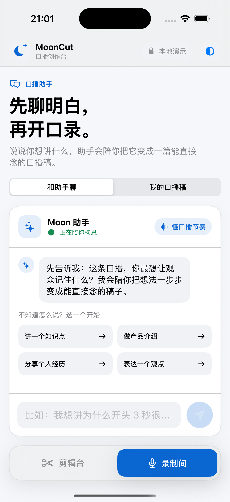
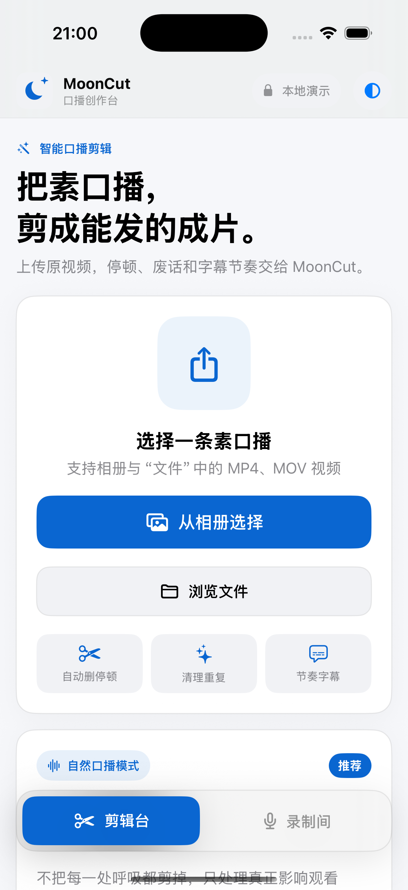
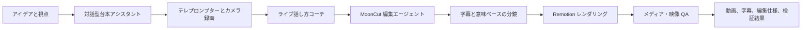
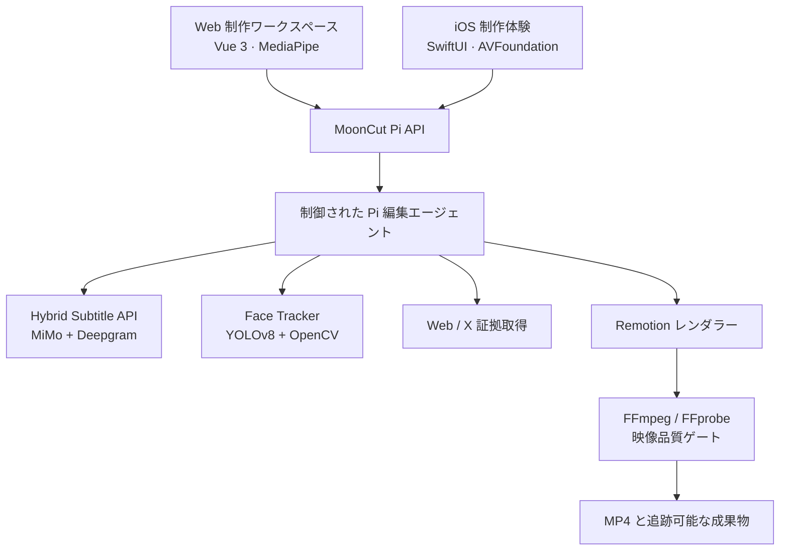

  

<h1 align="center">MoonCut</h1>

  <strong>ひとつのアイデアを、公開したくなる話す動画へ。</strong> 
  発想、台本、テレプロンプター録画から検証済みの完成動画までをつなぐ AI 口播クリエイティブ・スタジオ

  <a href="./README.md">简体中文</a> ·
  <a href="./README.en.md">English</a> ·
  <a href="./README.ja.md">日本語</a> ·
  <a href="./README.ko.md">한국어</a> ·
  <a href="./README.es.md">Español</a>

  
  

> **ひとことで言うと：** MoonCut は、話す動画の制作を見えないブラックボックスにしません。伝えたいことを整え、自信を持って録画し、実際の字幕、意味に基づく分鏡、品質ゲートによって完成動画へと仕上げます。

## 誰のための製品か

MoonCut は、継続的にカメラの前で話す必要がある一方で、白紙からの台本作り、何度もの撮り直し、タイムラインの細かな編集に時間を使いたくない人のための製品です。知識を共有する人、プロダクト・ブランドチーム、個人クリエイター、学生コミュニティ、そして考えを明確に伝えたいすべての人に向いています。

「話したいことがある」から「共有できる動画がある」までをつなぎ、話し手本来の言葉づかい、構図、リズムを大切にします。

## 制作の流れ

| 場面 | クリエイターが見るもの | MoonCut が行うこと |
| --- | --- | --- |
| 考える | ガイド付き対話、テーマ案、編集可能な台本 | テーマ、視点、語り口を、実際に口にできる表現へまとめます。 |
| 録る | テレプロンプター、ミラー、カウントダウン、一時停止/再開 | ブラウザまたはネイティブカメラで収録し、そのまま編集へ渡します。 |
| 練習する | 話す速さ、音量、間、視線のヒント | 音声と映像をリアルタイムにローカル分析し、必要な時だけ短い助言を出します。 |
| 編集する | 明確な進捗段階、完成プレビュー | 時間に正確な字幕と意味ベースの編集仕様を作り、完成動画を描画します。 |
| 確認する | 完成動画、コンタクトシート、QA 成果物 | 配信前にメディア特性と重要な映像箇所を確認します。 |

## 主な機能

### 会話から、話せる台本へ

- テーマ、想定視聴者、トーンをたどる対話から、異なる三つの切り口を提案します。
- 自然な話し言葉、短尺、感情表現の三方向で台本を生成・推敲します。
- 下書き、会話、選択した制作設定をクライアント側に保持し、自然に再開できます。

### テレプロンプター録画とライブコーチ

- フロントカメラ、テレプロンプター、ミラー、カウントダウン、一時停止/再開、テイク確認を一つの導線にまとめます。
- ブラウザ音声認識で台本との対応を見ながら、音声分析で話速・音量・有効な間を推定し、MediaPipe 顔ランドマークで構図と視線を補助します。
- ブラウザ機能や権限が使えない場合も、完全なデモ体験へ適切にフォールバックします。サービス接続時には低遅延モデルによる助言も利用できます。

### 話す動画のための AI 編集

- アップロードした動画から非同期編集ジョブを作成し、素材確認、文字起こし、人物追跡、分鏡計画、レンダリング、検証を明確に表示します。
- `mooncut.edit.v1` に、時間、見出し、本文、キーワード、画面種別、人物レイアウトを持つ意味的なタイムラインを保存します。
- 主話者のメイン映像は元の構図を維持します。顔追跡は解説、引用、根拠シーンでの安定した丸型オーバーレイに限定し、視点の飛びを防ぎます。
- デスクトップ風の解説カード、重要な引用、控えめなインパクト文字、元映像、信頼できる Web 証拠を扱えます。

### 信頼できる字幕と検証

- **MiMo** のテキスト品質と **Deepgram Nova-3** の音響タイミングを組み合わせて整列します。
- 長いメディアを標準化し、無音で文脈を残したまま分割。用語集に対応し、文字・単語・字幕セグメントの三層タイムラインを返します。
- JSON、SRT、WebVTT を出力。補間や不確かな範囲も見える形で残し、完全であるかのように隠しません。
- 本当に必要な場合だけ、実在する公式 Web ページや検証済みのオリジナル X 投稿をそのまま証拠として動画に入れます。
- FFprobe によるコーデック、解像度、長さ、音声の確認と、コンタクトシート、重要フレームのマルチモーダル検査を実施します。重大な失敗は分鏡修正と再レンダリングを要求します。

### 複数デバイスの制作空間

- Web はランディングページ、録画室、編集スタジオを備え、ライト、ダーク、Memphis のテーマとデスクトップ/モバイルレイアウトに対応します。
- iOS は話すアシスタント、台本、テレプロンプター録画、再生、読み込み、共有を SwiftUI、AVFoundation、PhotosUI で提供します。
- クリエイティブ・コンパニオン「小月」は、考案、録画、処理、完了の状態に合わせて反応します。

## MoonCut の考え方

| 製品上の選択 | クリエイターにとっての意味 |
| --- | --- |
| **編集より先に表現** | 空のタイムラインではなく、視点と台本から始められます。 |
| **実際の時間に同期** | 字幕、キーワード、インパクト演出を本当の発話時間に合わせます。 |
| **元の構図を守る** | 追跡は小さな補助オーバーレイのためだけに使い、メイン映像を強制的に再構図しません。 |
| **追跡可能な成果物** | 動画だけでなく、編集仕様、字幕、顔追跡、コンタクトシート、ログ、検証結果が残ります。 |
| **模倣ではなく根拠** | 公式ページや投稿は、取得した一次資料として表示されます。 |

## 製品の構成

| レイヤー | 技術・依存関係 | 製品での役割 |
| --- | --- | --- |
| クリエイティブ UI | Vue 3、TypeScript、Vite、MediaPipe Tasks Vision | 台本、録画、ライブコーチ、ジョブ状態、ローカルデモ。 |
| ネイティブモバイル | SwiftUI、AVFoundation、AVKit、PhotosUI | iPhone のカメラ、テレプロンプター、再生、読み込み、共有。 |
| エージェント編成 | Node.js、TypeScript、`@earendil-works/pi` SDK、OpenAI 互換モデルゲートウェイ | 確認、文字起こし、計画、レンダリング、検証を制御された順序で実行。 |
| 字幕 | Python、FastAPI、MiMo、Deepgram、FFmpeg、jieba | テキストの正確さと単語レベルの音響タイミングを統合。 |
| 人物処理 | Python、Ultralytics YOLOv8、OpenCV、LAP | 主話者を安定して追跡し、再利用できる正規化軌跡を出力。 |
| 描画と検証 | React、Remotion、FFmpeg、FFprobe | 意味的タイムラインの動画化とメディア/映像 QA。 |

標準のモデルルーティングは設定可能です。GLM は計画と台本、DeepSeek Flash はライブコーチ、MiniMax M3 は映像確認、MiMo v2.5 は映像フォールバックに使われます。モデル名やゲートウェイは製品ロジックに固定されていません。

## インターフェース、CLI、Skills

`MoonCut Pi Video Editor API` は、素材アップロード、非同期編集、状態確認、成果物ダウンロード、台本アシスタント、ライブコーチ、そして「準備してから確認する」完了メールを提供します。完了ジョブでは次の成果物を取得できます。

`video` · `editSpec` · `subtitles` · `faceTrack` · `sourceInspection` · `sourceContactSheet` · `finalContactSheet` · `verification` · `renderProps` · `renderLog` · `piEvents` · `agentSummary`

| コマンド / Skill | 目的 |
| --- | --- |
| Pi パッケージの `serve` / `edit` / `models` エントリ | ローカルサービスの実行、実動画の編集、モデルルーティング確認。 |
| `mooncut-face-track analyze` / `render` / `run` | 主話者の解析、安定化、縦・正方形・横・円形プレビューへの再構図。 |
| Remotion の `render` / `transcribe` / `materials:*` | 動画レンダリング、字幕生成、検索可能な視覚素材ライブラリの維持。 |
| `wc26` | 公式 FIFA ハイライト、中文試合ページ、ブラウザ画面を探す独立素材ツール。MoonCut の中核ユーザー機能ではありません。 |
| `mooncut-editor` | 確認 → 字幕 → 追跡 → 仕様 → 描画 → 検証の制作ループを固定。 |
| `browser-evidence` | 公開 Web ページとアクセシビリティ・スナップショットを一次映像証拠として取得。 |
| `x-post-evidence` | 明示的な信頼済みアカウント許可リストのもと、未改変の X 投稿画像を保存。 |

編集エージェントが持つのは、検査、文字起こし、追跡、Web 証拠、X 証拠、仕様保存、レンダリング、検証の八つの制御済みツールだけです。任意の shell 権限は持たず、モデル主導の制作を監査可能な境界に保ちます。

## リポジトリ構成

| ディレクトリ | 製品上の役割 |
| --- | --- |
| [`mooncut-web`](./mooncut-web) | ブラウザ制作ワークスペースとランディングページ。 |
| [`ios`](./ios) | ネイティブ iPhone 体験と製品スクリーンショット。 |
| [`mooncut-pi-agent`](./mooncut-pi-agent) | 編集エージェント、HTTP API、ジョブキュー、品質ゲート、Pi Skills。 |
| [`hybrid-subtitle-service`](./hybrid-subtitle-service) | 独立デプロイ可能な非同期ハイブリッド字幕 API。 |
| [`face-tracker`](./face-tracker) | 主話者追跡、安定化、再構図、CLI。 |
| [`remotion-studio`](./remotion-studio) | データ駆動の映像構図、字幕、素材、レンダリング。 |
| [`docs`](./docs) | 話者追跡に関する製品制約。 |
| [`information-bases`](./information-bases) | デバイス連携、BGM などの製品調査。 |

## 現在の状態とデータ境界

このリポジトリには、**実サービスに接続できる制作パイプライン**と、体験を探索しやすい**ローカルデモ画面**の両方が含まれます。

- Web はサービス未接続でも制作フローをデモできます。Pi API 接続時には素材をアップロードし、実際のジョブ進捗と成果物を表示します。
- iOS は現在、ネイティブな操作とローカル状態機械を提供します。スマート編集、字幕、最終書き出しプレビューはデモ実装であり、AI/レンダリングサービスにはまだ接続されていません。
- 実編集では、素材は設定されたローカル Agent に届きます。音声は設定済みの MiMo / Deepgram 字幕プロバイダーへ、コンタクトシートは設定済みの映像モデルゲートウェイへ送信される場合があります。本番運用ではデータフロー、保存期間、削除方法を明示してください。
- メール通知は「準備 → ユーザー確認 → 送信」の二段階です。完了しただけでメールが自動送信されることはありません。

---

  <strong>編集の負担を減らし、表現の余白を増やす。</strong> 
  MoonCut — Speak naturally. Ship confidently.

