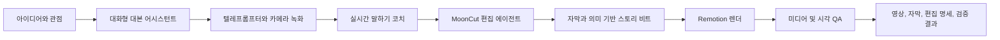
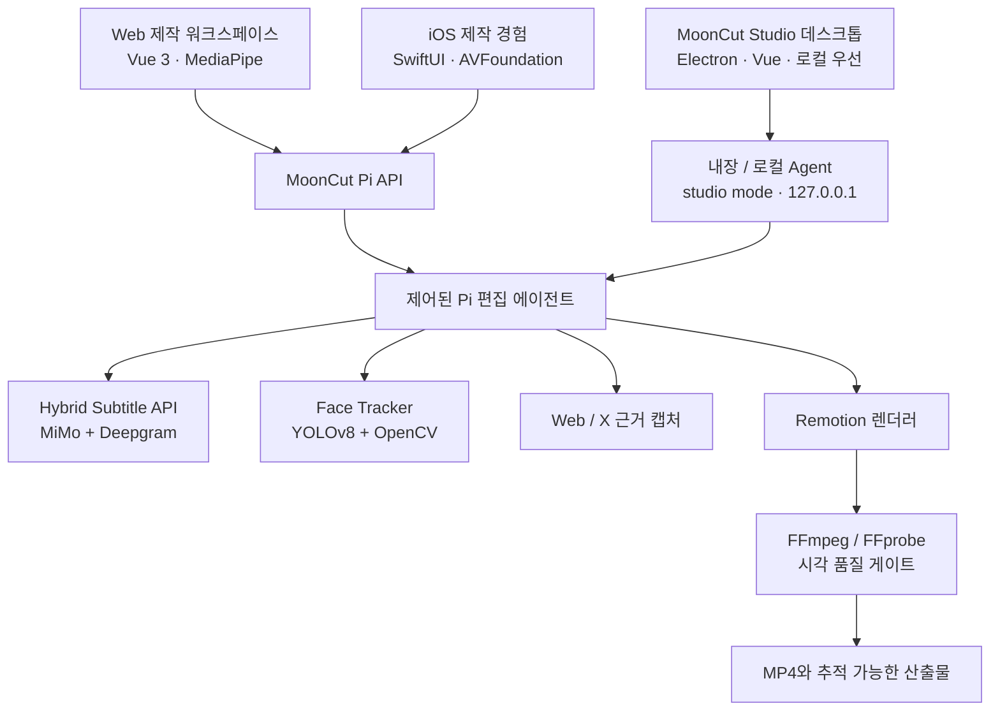

<p align="center">
  
</p>

<h1 align="center">MoonCut</h1>

<p align="center">
  <strong>하나의 생각을, 공개하고 싶은 말하기 영상으로.</strong><br />
  아이디어, 대본, 텔레프롬프터 녹화부터 검증된 완성본까지 연결하는 AI 스피킹 비디오 스튜디오
</p>

<p align="center">
  <a href="./README.md">简体中文</a> ·
  <a href="./README.en.md">English</a> ·
  <a href="./README.ja.md">日本語</a> ·
  <a href="./README.ko.md">한국어</a> ·
  <a href="./README.es.md">Español</a>
</p>

<p align="center">
  
  
  
</p>

> **한 줄로 말하면:** MoonCut은 말하기 영상 제작을 보이지 않는 블랙박스로 만들지 않습니다. 전달할 내용을 정리하고, 자신 있게 녹화한 뒤, 실제 자막·의미 기반 분할·품질 게이트로 완성 영상을 만듭니다.

## 완성 영상을 보세요

아래 두 데모는 Git LFS 미디어로 이 리포지토리에 포함되어 있으며, 직접 열거나 내려받을 수 있습니다.

| 데모 | 완성 영상 | 보여 주는 점 |
| --- | --- | --- |
| **Moonshot Plan · Physical AI 해커톤 현장**<br />41초 · 1280×720 | [▶ MP4 보기](./remotion-studio/out/moonshot-gpt56-horizontal-v2-xhs.mp4)<br />[샤오홍슈 현장 기록: “탐월계획 해커톤 현장에 정말 압도됐다”](http://xhslink.com/o/R8BbBY1Qe1) | 행사 정보, 실제 웹 근거, 화자 영상, 강조 자막을 한데 묶은 현장 제작 예시입니다. |
| **아르헨티나 vs 이집트 · 월드컵 경기 분석**<br />97초 · 1920×1080 | [▶ MP4 보기](./remotion-studio/out/argentina-egypt-analysis-v2.mp4) | 공식 하이라이트, 경기 이벤트 타임라인, 스코어 카드, 해설자를 리듬감 있는 분석 영상으로 구성합니다. |

## 누구를 위한 제품인가

MoonCut은 꾸준히 카메라 앞에 서야 하지만 빈 화면에서의 대본 작성, 반복 촬영, 타임라인 미세 편집에 많은 시간을 쓰고 싶지 않은 사람을 위한 제품입니다. 지식 공유자, 제품·브랜드 팀, 독립 크리에이터, 학생 커뮤니티, 그리고 자신의 생각을 더 명확히 전하고 싶은 모두에게 적합합니다.

“말하고 싶은 것이 있다”에서 “공유할 수 있는 영상이 있다”까지 연결하면서, 화자의 말투·구도·자연스러운 리듬을 지킵니다.

## 제작 흐름



| 단계 | 크리에이터가 보는 것 | MoonCut이 하는 일 |
| --- | --- | --- |
| 생각 | 안내형 대화, 주제 제안, 편집 가능한 대본 | 주제, 관점, 말투를 실제로 말하기 좋은 표현으로 정리합니다. |
| 녹화 | 텔레프롬프터, 미러, 카운트다운, 일시 정지/재개 | 브라우저 또는 네이티브 카메라로 촬영하고 편집으로 바로 넘깁니다. |
| 연습 | 속도, 볼륨, 멈춤, 시선 안내 | 오디오와 비디오를 로컬에서 실시간 분석해 필요할 때 짧고 실행 가능한 조언을 줍니다. |
| 편집 | 명확한 단계, 진행률, 완성본 미리보기 | 시간에 맞는 자막과 의미 기반 편집 명세를 만들고 영상으로 렌더링합니다. |
| 검증 | 완성 영상, 콘택트 시트, QA 산출물 | 전달 전에 미디어 속성과 중요한 시각 구간을 확인합니다. |

## 주요 기능

### 대화에서 바로 말할 수 있는 대본까지

- 주제, 대상 시청자, 톤을 따라가며 서로 다른 세 가지 콘텐츠 관점을 제안합니다.
- 자연스러운 구어체, 짧은 형식, 감성 표현 방향으로 대본을 생성하고 다듬습니다.
- 초안, 대화, 선택한 제작 설정을 클라이언트에 보존해 자연스럽게 이어서 작업할 수 있습니다.

### 텔레프롬프터 녹화와 실시간 코칭

- 전면 카메라, 텔레프롬프터 스크롤, 미러, 카운트다운, 일시 정지/재개, 테이크 검토를 한 흐름으로 제공합니다.
- 브라우저 음성 인식으로 대본 진행을 따라가고, 오디오 분석으로 말하기 속도·볼륨·유효한 쉼을 추정하며, MediaPipe 얼굴 랜드마크로 구도와 시선 피드백을 돕습니다.
- 브라우저 기능이나 권한을 사용할 수 없을 때도 완전한 데모 경험으로 자연스럽게 전환됩니다. 서비스 연결 시 저지연 모델 조언을 더할 수 있습니다.

### 말하기 영상에 맞춘 AI 편집

- 업로드한 원본에서 비동기 편집 작업을 생성하고, 소재 검사·전사·화자 추적·분할 계획·렌더·검증 단계를 명확히 보여줍니다.
- `mooncut.edit.v1`에 시간, 제목, 본문, 키워드, 화면 유형, 화자 레이아웃을 가진 의미 기반 타임라인을 저장합니다.
- 메인 화자 장면은 원래 구도를 유지합니다. 얼굴 추적은 설명·인용·근거 장면의 안정적인 원형 화자 오버레이에만 사용해 산만한 화면 점프를 막습니다.
- 데스크톱 설명 카드, 핵심 인용, 절제된 임팩트 텍스트, 원본 영상, 신뢰할 수 있는 웹 근거를 지원합니다.

### 신뢰도 높은 자막과 품질 검증

- **MiMo**의 텍스트 품질과 **Deepgram Nova-3**의 음향 타이밍을 결합하고 정렬합니다.
- 긴 미디어를 표준화하고, 문맥을 남긴 채 무음 구간에서 나누며, 용어집을 적용합니다. 문자·단어·자막 구간의 세 단계 타임라인을 반환합니다.
- JSON, SRT, WebVTT를 제공하며, 보간 또는 불확실한 구간도 검토할 수 있게 남깁니다.
- 필요할 때 실제 공개 웹 페이지 또는 검증된 원본 X 게시물을 그대로 영상 근거로 사용합니다.
- FFprobe로 코덱·해상도·길이·오디오를 확인하고, 콘택트 시트와 핵심 프레임 멀티모달 검사를 수행합니다. 심각한 실패는 분할 수정, 재렌더, 재검증을 요구합니다.

### 여러 기기를 잇는 제작 공간

- Web은 랜딩 페이지, 녹화실, 편집 스튜디오와 라이트·다크·Memphis 테마를 제공하며 데스크톱과 모바일 레이아웃에 대응합니다.
- iOS는 SwiftUI, AVFoundation, PhotosUI로 말하기 어시스턴트, 대본, 텔레프롬프터 녹화, 재생, 가져오기, 공유를 제공합니다.
- 창작 동반자 “샤오웨”는 구상·녹화·처리·완료 상태에 맞춰 반응합니다.

### MoonCut Studio · 로컬 전문 데스크톱 워크스테이션

- **[MoonCut Studio](./mooncut-studio/README.md)** 는 monorepo 안의 **완전한 데스크톱 Studio 패널 / OS형 앱**(Electron + Vue)으로, 본기에서 제작을 닫고 싶은 크리에이터를 위한 제품입니다.
- **로그인 불필요·클라우드 신원 없음**: 프로젝트·소재·작업·내보내기는 선택한 작업 디렉터리에 저장. API 키는 OS 보안 저장소 사용.
- 상단 네 패널: **프로젝트 라이브러리 → 말하기 창작 → 편집 워크벤치 → 설정**.
- 설치 패키지에 pi-agent, Remotion, FFmpeg, 자막·얼굴 추적 런타임을 포함할 수 있습니다. 자세한 사용법: [mooncut-studio/README.md](./mooncut-studio/README.md).

## MoonCut의 선택

| 제품 선택 | 크리에이터에게 주는 의미 |
| --- | --- |
| **편집보다 표현 먼저** | 빈 타임라인이 아니라 관점과 대본에서 시작합니다. |
| **실제 시간에 맞춤** | 자막, 키워드, 임팩트 애니메이션을 실제 발화 시간에 맞춥니다. |
| **원본 구도 유지** | 추적은 작은 보조 오버레이를 위한 것이며 메인 카메라를 계속 재구성하지 않습니다. |
| **추적 가능한 산출물** | 완성 영상과 함께 편집 명세, 자막, 얼굴 트랙, 콘택트 시트, 로그, 검증 결과를 받습니다. |
| **모방이 아닌 근거** | 공식 페이지와 게시물은 캡처된 원본 자료로 표시됩니다. |

## 제품 구성



| 계층 | 기술 및 의존성 | 제품 역할 |
| --- | --- | --- |
| 창작 UI | Vue 3, TypeScript, Vite, MediaPipe Tasks Vision | 대본, 녹화, 실시간 코칭, 작업 상태, 로컬 데모. |
| **데스크톱 Studio** | Electron, Vue 3, IPC 허용 목록, 번들 runtime | 로그인 없는 로컬 프로젝트 라이브러리·창작·편집·설정. [mooncut-studio](./mooncut-studio/README.md). |
| 네이티브 모바일 | SwiftUI, AVFoundation, AVKit, PhotosUI | iPhone 카메라, 텔레프롬프터, 재생, 가져오기, 공유. |
| 에이전트 오케스트레이션 | Node.js, TypeScript, `@earendil-works/pi` SDK, OpenAI 호환 모델 게이트웨이 | 검사, 전사, 계획, 렌더, 검증을 제어된 순서로 진행. |
| 자막 | Python, FastAPI, MiMo, Deepgram, FFmpeg, jieba | 텍스트 정확도와 단어 단위 음향 타이밍을 결합. |
| 화자 처리 | Python, Ultralytics YOLOv8, OpenCV, LAP | 주 화자를 안정적으로 고정하고 재사용 가능한 정규화 트랙을 출력. |
| 렌더와 검증 | React, Remotion, FFmpeg, FFprobe | 의미 기반 타임라인을 영상으로 렌더하고 미디어/시각 QA 수행. |

기본 모델 라우팅은 설정 가능합니다. GLM은 계획과 대본, DeepSeek Flash는 실시간 코칭, MiniMax M3는 시각 검사, MiMo v2.5는 시각 폴백을 담당합니다. 모델명과 게이트웨이는 제품 로직에 고정되어 있지 않습니다.

## 인터페이스, CLI, Skills

`MoonCut Pi Video Editor API`는 소재 업로드, 비동기 편집, 상태 조회, 산출물 다운로드, 대본 어시스턴트, 실시간 코칭, 그리고 “준비 후 확인” 완료 메일 흐름을 제공합니다. 완료된 작업에서는 다음 산출물을 얻을 수 있습니다.

`video` · `editSpec` · `subtitles` · `faceTrack` · `sourceInspection` · `sourceContactSheet` · `finalContactSheet` · `verification` · `renderProps` · `renderLog` · `piEvents` · `agentSummary`

| 명령 / Skill | 목적 |
| --- | --- |
| Pi 패키지의 `serve` / `edit` / `models` 엔트리 | 로컬 서비스 실행, 실제 영상 편집, 모델 라우팅 확인. |
| `mooncut-face-track analyze` / `render` / `run` | 주 화자 분석·안정화·세로/정사각/가로/원형 미리보기 재구성. |
| Remotion의 `render` / `transcribe` / `materials:*` | 영상 렌더, 자막 생성, 검색 가능한 시각 자료 라이브러리 유지. |
| `wc26` | 공식 FIFA 하이라이트, 중국어 경기 페이지, 브라우저 화면을 찾는 독립 자료 도구이며 MoonCut의 핵심 사용자 기능은 아닙니다. |
| `mooncut-editor` | 검사 → 자막 → 추적 → 명세 → 렌더 → 검증 제작 루프를 강제. |
| `browser-evidence` | 공개 웹 페이지와 접근성 스냅샷을 1차 시각 근거로 캡처. |
| `x-post-evidence` | 명시적인 신뢰 계정 허용 목록 아래 원본 그대로의 X 게시물 스크린샷 저장. |

편집 에이전트에는 검사, 전사, 추적, 웹 근거, X 근거, 명세 저장, 렌더, 검증의 여덟 가지 제어된 도구만 있습니다. 임의 shell 권한이 없으므로 모델 주도 제작이 감사 가능한 경계 안에 머뭅니다.

## 리포지토리 지도

| 디렉터리 | 제품 역할 |
| --- | --- |
| [`mooncut-studio`](./mooncut-studio/README.md) | **데스크톱 Studio 패널 / 로컬 전문 워크스테이션**(Electron). 상세: [Studio README](./mooncut-studio/README.md). |
| [`mooncut-web`](./mooncut-web) | 브라우저 제작 워크스페이스와 랜딩 페이지. |
| [`ios`](./ios) | 네이티브 iPhone 경험과 제품 스크린샷. |
| [`mooncut-pi-agent`](./mooncut-pi-agent) | 편집 에이전트, HTTP API, 작업 큐, 품질 게이트, Pi Skills. |
| [`hybrid-subtitle-service`](./hybrid-subtitle-service) | 독립 배포 가능한 비동기 하이브리드 자막 API. |
| [`face-tracker`](./face-tracker) | 주 화자 추적, 안정화, 재구성, CLI. |
| [`remotion-studio`](./remotion-studio) | 데이터 기반 영상 구성, 자막, 자료, 렌더링. |
| [`docs`](./docs) | 화자 시각 추적의 제품 제약. |
| [`information-bases`](./information-bases) | 기기 연동, BGM 등 제품 조사 자료. |

## MoonCut Studio (데스크톱 입구)

본기 클로즈드 루프·로그인 불필요·설치 패키지형 워크스테이션:

**→ [mooncut-studio/README.md](./mooncut-studio/README.md)**

```bash
cd mooncut-studio
npm install && npm run build && npm run dev
```

## 현재 상태와 데이터 경계

이 리포지토리에는 **실제 서비스에 연결 가능한 제작 파이프라인**과, 경험을 쉽게 살펴볼 수 있는 **로컬 데모 UI**가 함께 있습니다.

- Web 워크스페이스는 서비스 없이도 제작 흐름을 시연할 수 있습니다. Pi API를 연결하면 소재를 업로드하고 실제 작업 진행과 산출물을 표시합니다.
- iOS 앱은 현재 네이티브 상호작용과 로컬 상태 머신을 제공합니다. 스마트 편집, 자막, 최종 내보내기 미리보기는 데모 구현이며 아직 AI/렌더링 서비스에 연결되어 있지 않습니다.
- **MoonCut Studio**는 기본 로컬 우선·로그인 불필요. 설정에서 켠 뒤에만 원격 모델에 접속합니다. [Studio 프라이버시](./mooncut-studio/docs/PRIVACY.md).
- 실제 편집 모드에서는 원본이 설정된 로컬 Agent로 먼저 전달됩니다. 오디오는 설정된 MiMo/Deepgram 자막 제공자로, 콘택트 시트는 설정된 비전 모델 게이트웨이로 전송될 수 있습니다. 운영 환경에서는 데이터 흐름, 보관 기간, 삭제 방법을 명확히 알려야 합니다.
- 이메일 알림은 “준비 → 사용자 확인 → 발송”의 두 단계입니다. 작업이 끝났다고 자동 발송되지 않습니다(Studio 기본선에는 메일 발송 없음).

---

<p align="center">
  <strong>편집의 마찰은 줄이고, 표현의 여백은 늘립니다.</strong><br />
  MoonCut — Speak naturally. Ship confidently.
</p>
