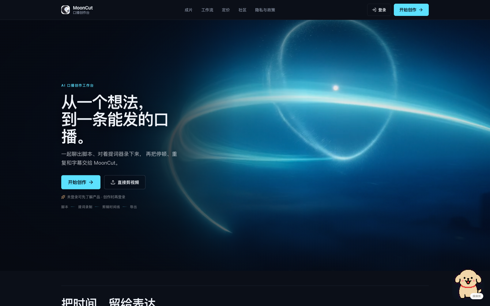
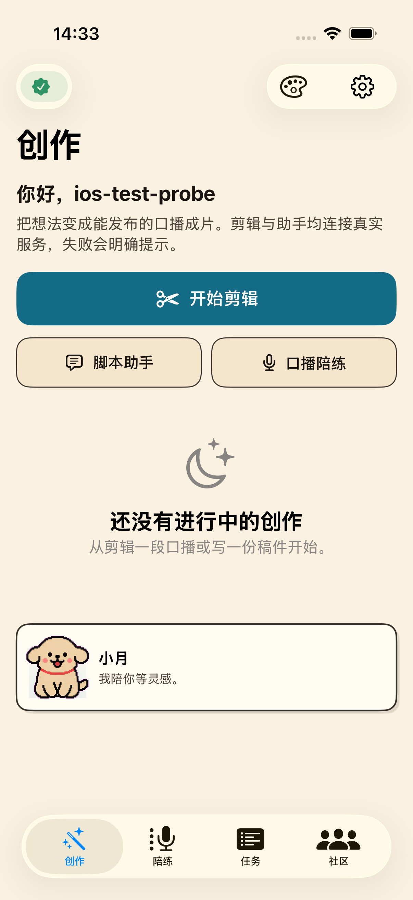
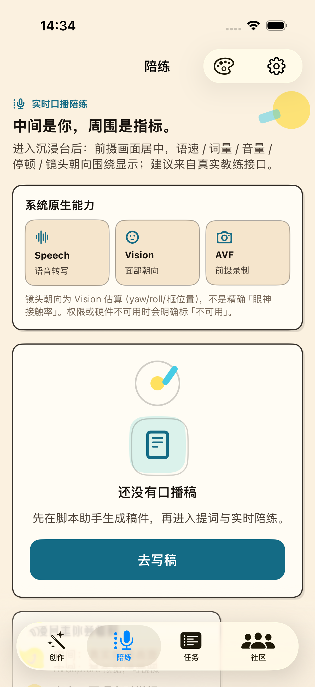
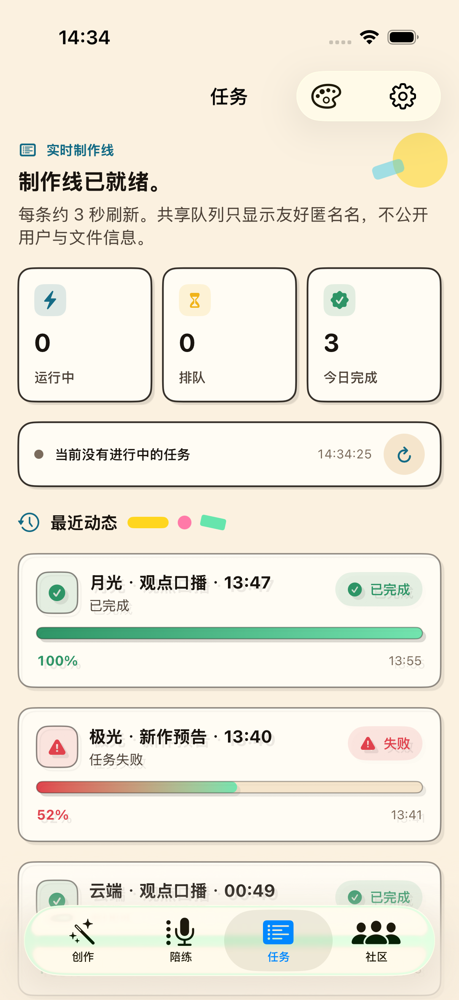
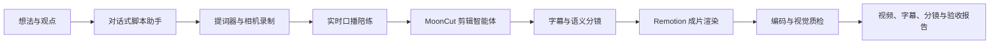
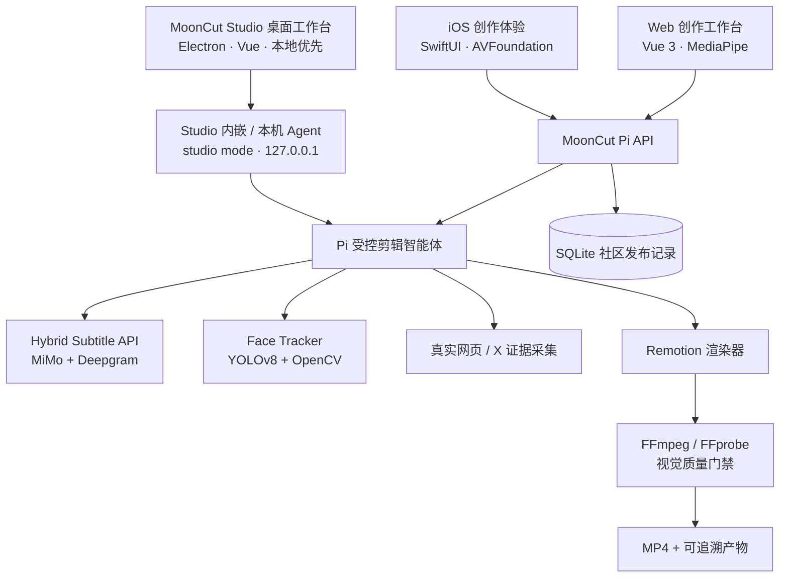

<p align="center">
  
</p>

<h1 align="center">MoonCut</h1>

<p align="center">
  <strong>把一个想法，变成一条值得发布的口播。</strong><br />
  AI 口播创作工作台 · 从构思、脚本、提词录制到可验证的成片
</p>

<p align="center">
  <a href="./LICENSE"></a>
</p>

<p align="center">
  <a href="https://mooncut.me"><strong>访问官网 · mooncut.me ↗</strong></a> ·
  <a href="https://mooncut.me">在线开始创作</a> ·
  <a href="./mooncut-studio/README.md">了解桌面 Studio</a> ·
  <a href="./docs/DEVELOPER_GUIDE.md">开发者指南</a>
</p>

<p align="center">
  <a href="./README.md">简体中文</a> ·
  <a href="./README.en.md">English</a> ·
  <a href="./README.ja.md">日本語</a> ·
  <a href="./README.ko.md">한국어</a> ·
  <a href="./README.es.md">Español</a>
</p>

<p align="center">
  <a href="https://mooncut.me">
    
  </a>
</p>

<p align="center">
  <sub>官网首屏快照 · <a href="https://mooncut.me">mooncut.me</a> · 点击图片即可进入在线创作入口</sub>
</p>

<p align="center">
  
  
  
</p>

> **在线体验**：先到 [mooncut.me](https://mooncut.me) 了解产品、试写脚本或开始创作；这个仓库保留 Web、iOS、桌面 Studio 与本地制作链路的实现细节，方便将每一步做得可控、可复现、可验证。

> **一句话**：MoonCut 不是把视频丢进“黑盒”里等结果，而是将口播创作拆成可控的表达链路——先把话说清楚，再把镜头录好，最后用真实字幕、语义分镜和质检把它做成成片。

## 看成片

两条成片的原始 MP4 都由 Git LFS 保存；GitHub 并不能稳定在线播放，因此下方固定使用官网的轻量封面，点击即可跳到可播放的作品区。

| 示例 | 官网预览 | 看点 |
| --- | --- | --- |
| **探月计划 · Physical AI 黑客松现场**<br />41 秒 · 1280×720 | <a href="https://mooncut.me/#works"></a><br />[▶ 在官网播放 ↗](https://mooncut.me/#works)<br />[小红书现场记录：探月计划黑客松现场，真的有被震撼到](http://xhslink.com/o/R8BbBY1Qe1) | 以现场口播串联活动信息、真实网页证据、人物镜头与重点字幕，是 MoonCut 的创作现场示例。 |
| **阿根廷 vs 埃及 · 世界杯赛事复盘**<br />97 秒 · 1920×1080 | <a href="https://mooncut.me/#works"></a><br />[▶ 在官网播放 ↗](https://mooncut.me/#works) | 将官方比赛集锦、事件时间线、比分卡与讲解人物组合为一条有叙事节奏的赛事分析视频。 |

## 为谁而做

MoonCut 面向需要持续出镜、却不想把大量时间耗在写稿、反复录制和时间线细修上的创作者：知识分享者、产品与品牌团队、独立创作者、校园社团和任何想把观点说得更清楚的人。

它把“我想说点什么”连接到“我已经有一条可发的视频”，同时尽量保留说话者自己的语气、原始构图和表达节奏。

## 一条完整的创作路径



| 阶段 | 用户看到什么 | MoonCut 在做什么 |
| --- | --- | --- |
| 想 | 聊天式引导、选题建议、可编辑的口播稿 | 根据主题、观点与语气组织成自然、能直接念的表达。 |
| 录 | 提词器、镜像、倒计时、暂停续录 | 用浏览器或原生相机采集素材，并把录制结果无缝交给剪辑台。 |
| 练 | 语速、音量、停顿、注视提示 | 在本地实时分析声音与画面，必要时给出一条短而能立刻执行的建议。 |
| 剪 | 进度、任务状态、成片预览 | 生成带真实时间轴的字幕和语义分镜，渲染为统一视觉语言的成片。 |
| 验 | 成片、联系表、验收产物 | 检查编码、时长、音频和重点视觉段；不合格时要求重新修订再渲染。 |

## 产品能力

### 1. 从对话到可说的稿

- 根据选题、受众和表达语气进行多轮引导，提供三个有区分度的内容切入点。
- 生成并润色口播稿，支持“自然口语、短内容、情绪表达”三种方向。
- 稿件、会话和选定的创作偏好会在端侧保留，方便中断后继续创作。

### 2. 提词录制与实时陪练

- 前置相机录制、提词滚动、镜像、倒计时、暂停/继续和录后复核构成一条顺滑的录制路径。
- 浏览器实时 ASR 用于对稿；音量采用快起慢落包络，语速使用滑动窗口与中值滤波，台词定位带单向迟滞，避免数字和当前句来回跳；MediaPipe 人脸关键点用于构图与注视提醒。
- 浏览器不支持某项能力或权限被拒绝时，仍可进入完整的演示体验；已接入服务时，陪练建议由低延迟模型生成。

### 3. 面向口播的 AI 剪辑

- 上传原片后创建异步剪辑任务，进度清晰分为素材检查、转写、人物跟踪、分镜规划、渲染与验收。
- 以 `mooncut.edit.v1` 保存语义分镜：每一个片段都有时间、标题、正文、关键词、画面类型与人物布局，而非不可追溯的一次性帧代码。
- 在保留主讲人原始大画面构图的前提下，只在讲解卡、引用和证据画面中使用稳定的圆形人物小窗，避免“AI 跟脸”造成画面来回跳动。
- 支持全屏重点词冲击、桌面解释卡、核心引语、原始素材与可信网页证据等节奏化画面。

### 4. 更可靠的字幕

- 混合字幕服务以 **MiMo** 提供更接近说话内容的文本，以 **Deepgram Nova-3** 提供声学时间戳，再将两者对齐。
- 长音频会先标准化、按静音切段并保留上下文；支持术语表，并输出字符、词、字幕段三层时间轴。
- 可交付 JSON、SRT 和 WebVTT；对插值或低置信区间保留标记，便于复核，而不是假装字幕绝对准确。
- 成片完成后可在预览中按时间点提交人工字幕反馈。字幕修复 Agent 只改动确认受影响的字幕，生成可审计、可切换的新版本并重新质检，原成片始终保留。

### 5. 可信内容证据与质量门禁

- 当口播需要佐证时，智能体可抓取真实官网页面或经账号白名单校验的原始 X 帖子；证据以原始截图进入成片，不重绘成“看起来像”的假卡片。
- 成片后由 FFprobe 检查编码、分辨率、时长和音轨，生成六宫格联系表。
- 对重点词冲击和真实证据片段抽帧进行多模态视觉检查；若发现硬性问题，流程会要求修改分镜、重新渲染并再次验收。

### 6. 跨端工作台与创作陪伴

- Web 端提供落地页、录制间、剪辑台以及浅色、深色和 Memphis 三套主题，兼顾桌面与移动布局。
- iOS 原生体验覆盖口播助手、稿件、提词录制、回放、导入和分享，并使用 SwiftUI、AVFoundation 与 PhotosUI。
- 创作搭子“小月”会随构思、录制、处理与完成状态变化，也会保留互动的开心值；它服务于创作过程，而不是打断表达。

### 7. MoonCut Studio · 本地专业桌面工作台

- **[MoonCut Studio](./mooncut-studio/README.md)** 是 monorepo 内的**完整桌面 Studio 面板 / 操作系统式 App**（Electron + Vue），面向需要本机闭环制作的创作者与团队。
- **无需登录、无云端身份**：项目、素材、任务与成片默认落在你选定的工作目录；密钥走系统安全存储。
- 顶栏四块主面板：**项目库 → 创作口播 → 剪辑台 → 设置**，覆盖写稿、提词录制、实时陪练、一键智能剪辑与诊断。
- 可打包内嵌 pi-agent、Remotion、FFmpeg、字幕与人脸跟踪运行时，终端用户不必再 checkout 整个仓库。
- 与 Web / iOS 共用同一条口播产品心智；Studio 是**离线专业工作站**，详细用法与架构见 [mooncut-studio/README.md](./mooncut-studio/README.md)。

## 为什么是 MoonCut

| MoonCut 的选择 | 带来的体验 |
| --- | --- |
| **先表达，后剪辑** | 创作从观点和可说的稿子开始，而不是面对空白时间线。 |
| **真实时间轴** | 字幕、关键词和重点动画对齐到真实口播时间，画面节奏不靠猜。 |
| **保留原始构图** | 跟踪只服务于辅助小窗，主镜头不被持续强行重构。 |
| **可追溯的中间产物** | 成片之外还能得到分镜 Spec、字幕、人物轨迹、联系表、渲染日志与验收报告。 |
| **真实而非仿真的证据** | 官网或原帖使用原始浏览器截图，来源可回看。 |
| **失败可恢复** | 字幕、人物跟踪或视觉模型暂不可用时会降级并明确说明，不用编造结果。 |

## 产品是怎样组成的



| 层级 | 采用的能力与依赖 | 在产品中的职责 |
| --- | --- | --- |
| 创作界面 | Vue 3、TypeScript、Vite、MediaPipe Tasks Vision | 脚本、录制、实时陪练、任务状态和本地演示。 |
| **桌面 Studio** | Electron、Vue 3、IPC 白名单、内嵌 runtime | 无登录的本机项目库、创作口播、剪辑台与设置面板；详见 [mooncut-studio](./mooncut-studio/README.md)。 |
| 能力市场与案例 | Node 内置 SQLite、受签名的能力 release、Range 视频流 | 用户为自己的 Pi 安装受控能力；创作案例保留质检通过的视频分享，历史任务默认私有。 |
| 原生移动端 | SwiftUI、AVFoundation、AVKit、PhotosUI | iPhone 上的相机、提词、回放、导入和分享体验。 |
| 智能体编排 | Node.js、TypeScript、`@earendil-works/pi` SDK、OpenAI 兼容模型网关 | 让模型按受控顺序完成检查、转写、分镜、渲染与验收。 |
| 字幕 | Python、FastAPI、MiMo、Deepgram、FFmpeg、jieba | 组合文本准确性与逐词声学时间戳。 |
| 人物处理 | Python、Ultralytics YOLOv8、OpenCV、LAP | 稳定锁定主讲人，生成可复用的归一化轨迹。 |
| 成片与验证 | React、Remotion、FFmpeg、FFprobe | 将分镜渲染成视频，并完成媒体与视觉 QA。 |

默认模型路由可配置为：GLM 负责剪辑规划与脚本、DeepSeek Flash 负责低延迟陪练、MiniMax M3 负责视觉检查，并以 MiMo v2.5 作为视觉回退。模型名称与网关均是可替换配置，不被产品逻辑写死。

## 接口、CLI 与 Skills

MoonCut 不只是一组页面。仓库将可重复的制作工作封装成面向产品流程的 API、命令和智能体技能。

### 产品接口

`MoonCut Pi Video Editor API` 提供素材上传、异步剪辑任务、任务状态、产物下载、脚本助手、实时陪练和完成通知接口。Agent Mail CLI 使用“准备后确认”，预授权事务邮件 Webhook 可在任务完成后自动投递。一次完成的任务可取得：

剪辑任务还支持可关闭的按需生图调度。默认不生成图片；只有真实素材难找、但抽象或假设示例确实能帮助理解时才生成，通常 1 张且单任务最多 2 张。生成图使用独立的 `illustration` 分镜并在画面标明“AI 生成示例 · 非事实证据”，不会混入真实网页/X 证据链。

`video` · `editSpec` · `subtitles` · `faceTrack` · `sourceInspection` · `sourceContactSheet` · `finalContactSheet` · `verification` · `renderProps` · `renderLog` · `piEvents` · `agentSummary`

### 已封装的 CLI

| 命令 / 入口 | 用途 | 产物 |
| --- | --- | --- |
| Pi 包的 `serve` / `edit` / `models` 入口 | 启动本地服务、提交单条真实视频、查看模型路由 | 任务 API、成片及完整任务产物。 |
| `mooncut-face-track analyze` | 分析口播素材并锁定主讲人 | `mooncut.face-track.v1` 轨迹 JSON。 |
| `mooncut-face-track render` / `run` | 使用既有轨迹生成竖版、方形、横版或圆形预览 | 重构预览视频与轨迹。 |
| Remotion 的 `render` / `transcribe` / `materials:*` | 渲染样片、生成字幕、维护可检索视觉素材库 | 可复现的成片、字幕与素材索引。 |
| `wc26` | 查询官方 FIFA 赛事集锦、中文赛况页和页面截图 | 首个官方能力包的受控适配器；Pi 只能通过白名单工具查询，下载仍不开放给市场。 |

### 内嵌 Pi Skills

| Skill | 约束与价值 |
| --- | --- |
| `mooncut-editor` | 固定“检查素材 → 字幕 → 跟踪 → 分镜 → 渲染 → 验收”的制作闭环。 |
| `browser-evidence` | 抓取真实公开网页及其可访问性快照，让页面以原始证据进入成片。 |
| `x-post-evidence` | 在显式可信账号白名单下寻找并保存未改造的 X 原帖截图。 |

智能体只可调用八个受控工具：检查素材、转写、人物跟踪、网页证据、X 证据、保存分镜、渲染和验收。它没有任意 shell 权限；这让“会思考的模型”仍然运行在可审计的产品边界内。

## 仓库地图

| 目录 | 产品角色 |
| --- | --- |
| [`mooncut-studio`](./mooncut-studio/README.md) | **桌面 Studio 面板 / 本地专业工作台**（Electron）：项目库、创作口播、剪辑台、设置；可打包完整制作运行时。详见 [Studio README](./mooncut-studio/README.md)。 |
| [`mooncut-web`](./mooncut-web) | 浏览器端创作工作台与产品落地页。 |
| [`ios`](./ios) | 原生 iPhone 创作体验与界面截图。 |
| [`mooncut-pi-agent`](./mooncut-pi-agent) | 剪辑智能体、HTTP 接口、任务队列、质量门禁与 Pi Skills。 |
| [`hybrid-subtitle-service`](./hybrid-subtitle-service) | 可独立部署的异步混合字幕 API。 |
| [`face-tracker`](./face-tracker) | 口播主讲人跟踪、稳定化与画幅重构 CLI。 |
| [`remotion-studio`](./remotion-studio) | 数据驱动的 Remotion 视频构图、字幕、素材与渲染能力。 |
| [`docs`](./docs) | [开发者指南](./docs/DEVELOPER_GUIDE.md)、[安全部署基线](./docs/SECURITY_DEPLOYMENT.md)、口播人物视觉跟踪与工程约束。 |
| [`information-bases`](./information-bases) | 围绕设备接入、背景音乐等产品决策的研究资料。 |

## 开发者指南

想运行、修改或部署 MoonCut，请从 **[开发者指南](./docs/DEVELOPER_GUIDE.md)** 开始。它按模块列出了最小开发环境、Web / Studio / Agent 联调路径、提交前验证命令、Cloudflare Secrets、私有 CA、iOS 重签与桌面签名公证边界。

| 你的目标 | 入口 |
| --- | --- |
| 修改官网或浏览器工作台 | [Web 本地开发](./docs/DEVELOPER_GUIDE.md#local-workflows) |
| 修改本机专业工作台 | [Studio 开发](./docs/DEVELOPER_GUIDE.md#local-workflows) |
| 接入真实剪辑、字幕与渲染 | [Web + 本地 Agent 联调](./docs/DEVELOPER_GUIDE.md#local-workflows) |
| 配置 HTTPS、API Key、iOS / 桌面签名 | [Secrets、TLS 与签名证书](./docs/DEVELOPER_GUIDE.md#signing-certificates) |
| 部署公开 Agent、Tunnel 或事务邮件 | [安全部署基线](./docs/SECURITY_DEPLOYMENT.md) |
| 判断可否 fork、商用或公开分发 | [许可证与第三方组件](./docs/DEVELOPER_GUIDE.md#licensing) |

## MoonCut Studio（桌面端入口）

需要**本机闭环、无登录、可打包安装**的口播工作台时，请直接进入：

**→ [mooncut-studio/README.md](./mooncut-studio/README.md)**（Studio 是什么、面板怎么用、开发与打包、隐私与架构）

简要对照：

| | Studio | Web | iOS |
| --- | --- | --- | --- |
| 形态 | 桌面 App | 浏览器 | iPhone App |
| 登录 | 不需要 | 可选 | 可选 |
| 默认数据 | 本机项目目录 | 浏览器 / 可接云端 Agent | 端侧 |
| 完整剪辑 runtime | 可内嵌安装包 | 依赖外部服务 | 需接服务 |

开发启动：

```bash
cd mooncut-studio
npm install && npm run build && npm run dev
```

## 当前状态与数据边界

MoonCut 的仓库同时包含**可连接真实服务的制作链路**与**便于体验产品流程的本地演示界面**，两者应被清楚区分：

- Web 端在未连接服务时可完整演示创作路径；接入 Pi API 后会上传素材并显示真实任务进度与产物。
- iOS 端当前以原生交互与本地状态机呈现体验，智能剪辑、字幕和导出成片预览仍是演示实现，尚未直连 AI/渲染服务。
- **MoonCut Studio** 默认本地优先、无登录；可内嵌真实 Agent 运行时。远程模型仅在用户于设置中启用并配置后访问；密钥不进入项目文件。详见 [Studio 隐私说明](./mooncut-studio/docs/PRIVACY.md)。
- 真实剪辑模式下，素材先进入配置的本地 Agent；音频可能发送给配置的 MiMo 与 Deepgram 字幕服务，联系表可能发送给配置的视觉模型网关。接入正式环境前，应向用户说明数据流、保留期限和删除方式。
- 默认 Agent Mail 通知采用“准备 → 用户确认 → 发送”两步，避免未经确认主动发信（Studio 基线不含邮件发送）。
- 需要无人值守投递时，可配置 `MOONCUT_MAIL_TRANSPORT=webhook`、服务端 URL、Bearer Token、发件地址与公开 Agent URL；仅应接入明确允许预授权自动发送的事务邮件服务。

## 许可证

MoonCut 源码采用 [Apache License 2.0](./LICENSE) 发布。你可以使用、修改与分发代码，但须保留许可证与必要的版权/归属声明；提交的修改应有清晰变更说明。Apache-2.0 **不**授予 MoonCut 名称、Logo 或其他商标的使用权。

仓库中的第三方依赖、模型权重和媒体资产仍受各自许可证约束。尤其是 FFmpeg 构建、Remotion、Ultralytics 组件与可再分发媒体，请在公开安装包、商用或 App Store 分发前按 [Studio 许可证清单](./mooncut-studio/docs/LICENSES.md) 核验。

---

<p align="center">
  <strong>少一点剪辑感，多一点表达力。</strong><br />
  MoonCut — Speak naturally. Ship confidently.
</p>
