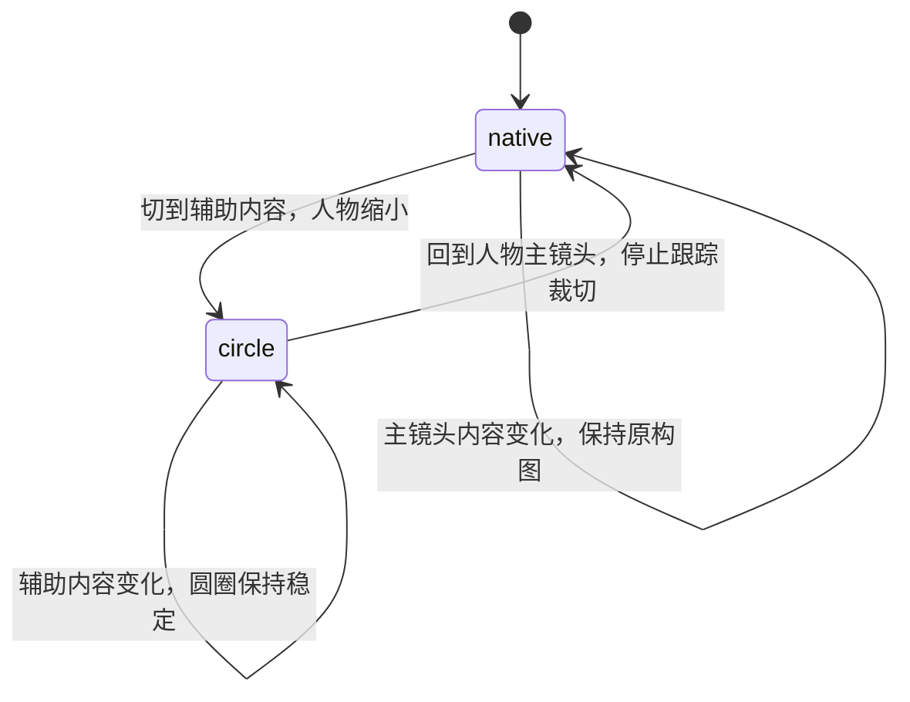

# MoonCut 口播人物视觉跟踪 Spec

状态：已实现  
适用范围：`TalkingHeadDemo`、`AgentTalkingHeadVideo`、`PerfectTalkingHeadVideo`、`mooncut-pi-agent`

## 1. 目标

人脸轨迹只解决一个问题：当主画面切到网页、截图、演示、文字卡或其他辅助内容时，把主讲人缩成干净、稳定的圆形小窗，并确保脸留在圆圈内。

它不是全局运镜。人物作为主画面、放大画面或情绪特写时，必须保留原素材构图，不根据逐帧人脸位置移动或缩放画面。

## 2. 镜头状态

### `native`

- 使用场景：`speaker`、`impact`，以及没有真实辅助素材的 `evidence`。
- 播放方式：原视频静态居中、`object-fit: contain`，比例不匹配时只增加模糊背景。
- 禁止：读取人脸轨迹来改变主画面的裁切中心或缩放。

### `circle`

- 使用场景：`desktop`、`quote`，以及带真实 `evidenceId` 的 `evidence`。
- 主画面：辅助内容占据主要视觉面积。
- 人物：固定在右上方的圆形叠加层，只有这一层读取 `mooncut.face-track.v1`。
- 相邻的 `circle` beat 共用同一位置、尺寸和进场状态，内容变化时圆圈不重新弹入。

## 3. 状态转换



- 只允许在语义 beat 边界转换。
- 单个连续状态至少保持 2500 ms。
- 进入或退出动画为 220 ms；连续同状态不重播动画。
- 圆圈从原素材的中性构图开始，用 650 ms 的 S 曲线缓慢移动、缩放到人脸构图，起止速度均为 0。
- 跟踪裁切使用前后对称的 720 ms、13 采样镜头滤波；贴边补画与安全夹紧之间使用连续权重，不允许单帧阈值跳变。
- 不为了某个词、手势或普通头动临时切换镜头状态。

## 4. 数据契约

```ts
type SpeakerLayout = 'native' | 'circle';

type CameraPolicy = {
  mode: 'track-small-overlays-only';
  trackedLayout: 'circle';
  nativeReframe: 'preserve-source';
  minimumLayoutHoldMs: 2500;
  transitionMs: 220;
  recenterDurationMs: 650;
};
```

`save_edit_spec` 会为每个 beat 写入 `speakerLayout`，并写入顶层 `cameraPolicy`。渲染器仍会按 beat 语义强制校正，旧版或错误 Spec 不能让大画面重新启用人脸跟踪。

| Beat | `speakerLayout` | 是否读取人脸轨迹 |
|---|---|---|
| `speaker` | `native` | 否 |
| `impact` | `native` | 否 |
| `desktop` | `circle` | 是 |
| `quote` | `circle` | 是 |
| `evidence` + `evidenceId` | `circle` | 是 |
| `evidence` 无素材 | `native` | 否 |

`PerfectTalkingHeadVideo` 使用同一原则：`metrics`、`pipeline`、`model-compare`、`product-ui`、`distribution` 共享固定圆圈；`speaker-focus`、`source-full`、`impact`、`closing` 使用原构图。

## 5. 圆形小窗规则

- 画幅固定为 1:1，形状固定为圆形。
- 默认脸部占圆圈短边约 68%，锚点为 `(0.5, 0.45)`。
- 每次进入圆圈都从中性画面缓入人脸中心；调用方不需要自行编写插值或补间。
- 正常靠边时允许模糊补边，保持脸部居中。
- 原片已经切脸，或补边接缝进入人脸安全区时，连续过渡到真实源边界；不得瞬间切换、镜像、复制或让模糊接缝穿过脸。
- 轨迹缺失时使用稳定的静态中心裁切，不逐帧搜索或跳动。

## 6. 音频规则

任意时刻只有一个有声人物视频：

- `native`：主视频承担声音。
- `circle`：圆形人物层承担声音，辅助内容保持无声。
- 禁止为了保留声音再放置第二个隐藏的有声视频。

## 7. 验收标准

- 大人物镜头不随脸部移动而平移或缩放。
- 辅助页面出现时，人物只以一个圆形小窗存在。
- 连续辅助页面之间圆圈位置、尺寸和动画连续。
- 圆圈启用的第一帧使用中性构图，随后平滑收敛；不得在首帧直接跳到最终人脸裁切。
- 当前两套真实回归素材的最大逐帧裁切变化必须保持在归一化画幅的 2% 以内。
- 任一 `native/circle` 状态不足 2500 ms 时 Spec 质检失败。
- `speaker/impact` 若声明为 `circle`，或辅助内容声明为 `native`，Spec 质检失败。
- 快速移动、贴边、短暂丢检和跳剪素材不得产生双脸、穿脸接缝或音频叠加。
