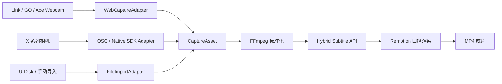

# Opportunities and Next Steps

## Opportunity Areas

### 1. “插上即开拍”的影石口播入口

- 获取权限后枚举视频/音频设备。
- 名称包含 `Insta360` / `Link` / `GO 3` / `Ace` 时优先提示，但始终允许手动选择。
- 分开选择摄像头与麦克风，显示实际分辨率/帧率而不是只显示请求值。
- 保存用户上次选择；设备拔出时停止录制并保留已完成分片。

### 2. 高画质“相机内录”模式

- X 系列：`OSC` 原型或 iOS/Android/Windows/Linux Camera SDK 开始/停止，后台下载文件。
- Ace/GO：由用户或相机按键录制，用 U-Disk / 文件选择自动导入最新 MP4。
- 与直录模式共用同一 `CaptureAsset` 契约，进入同一字幕/剪辑管线。

### 3. 360 口播的差异化能力

- 一次录制后自动生成横屏、竖屏、近景、半身和不同机位版本。
- 用 ASR 和人脸/姿态跟踪驱动取景，在重点句自动推近，而不是手工打关键帧。
- 该能力只在确认有 X 系列用户和实际重构图需求后立项。

## Differentiation Hypotheses

- 创作者的主要价值感来自“录完立即进剪辑”，而不是参数控制页数。
- 对桌面口播，Link 的跟踪/自动构图 + MoonCut 的提词/自动字幕是最自然的产品组合。
- 对 X 系列，“先拍完，后构图”比“在 MoonCut 内复制影石 App 所有参数”更有差异化。

## Validation Experiments

### Experiment A：UVC/Webcam 实机尖刺（最高优先级）

目标设备：Link 2/Link 2 Pro，或用户现有的 GO/Ace。

通过标准：

1. Chrome 和主目标浏览器可枚举出明确的视频/音频设备名。
2. 能用 `deviceId` 精确选择，拔插后可恢复。
3. 1080p30 连续录 5 分钟无中断，音画漂移在可接受范围。
4. 停止后 2 秒内出现可预览文件，FFmpeg 可正常读取。
5. 影石物理流和 Virtual Camera 流都记录真实可用规格。

### Experiment B：端到端素材交接

1. `VideoAsset` 升级为可持久化的 `CaptureAsset`（File/Blob、MIME、时长、宽高、fps、deviceId/label、audioDevice）。
2. 录制停止后 POST 到 `/v1/subtitle-jobs`。
3. 轮询任务，保存 JSON/SRT/VTT，把资产 URL 和字幕参数传给 Remotion。
4. 渲染一条非固定 demo 的真实口播成片。

### Experiment C：X 系列 OSC 高画质原型

1. 连接相机热点，用本地桥调用 `camera.startCapture` / `camera.stopCapture`。
2. 获取 `fileUrls` 并下载。
3. 测量命令延迟、停止到文件可用时间、下载速度以及同时上云可行性。
4. 如果是 INSV，确认最终平面口播导出所需平台/GPU/时间。

## Sources to Monitor

- https://github.com/Insta360Develop/Insta360-Developer_Docs — 新官方文档和 GO/ACE/Link 开放状态。
- https://github.com/Insta360Develop — Android/iOS/Desktop Camera/Media SDK 更新。
- https://www.insta360.com/developer/home — 官方版本与申请入口。
- https://onlinemanual.insta360.com/developer/zh-cn/resource/integration — 机型、连接和能力限制更新。

## Recommended Architecture

## Phased Delivery

### Phase 0：1–3 天，影石直录 MVP

- 设备枚举、摄像头/麦克风选择、影石优先提示。
- 1080p30 默认录制，记录 `getSettings()` 实际规格。
- 设备断连、重新扫描和录制容错。
- 结果保留真实 File/Blob，不再只传 Blob URL。

### Phase 1：3–5 天，打通 AI 剪辑链路

- 前端上传字幕任务、轮询和错误处理。
- FFmpeg 将 WebM/MOV/H.265 统一成渲染可用的 MP4。
- 将动态素材与逐词字幕交给 Remotion，替换固定 demo 资产。

### Phase 2：1–2 周，高画质内录

- 实现 `discover / preview / start / pause / stop / pull / status` 统一适配器接口。
- macOS 首先加 OSC 或 U-Disk 适配器；X 系列实现开停+下载。
- 需实时预览和参数控制时，在 iOS 工程集成官方 SDK，或做 Android/Windows/Linux 伴侣。

### Phase 3：有需求证据后，360 自动取景

- 申请 Camera + Media SDK，锁定机型和版本。
- 设立 Windows/Linux GPU 拼接/导出工人，输出标准 MP4。
- 加入横/竖屏自动重构图，而不把 INSV 复杂度泄露给普通用户。
