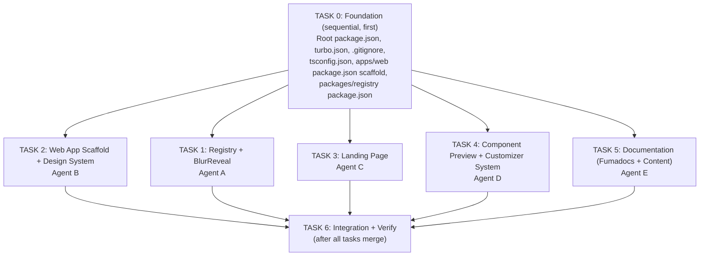

# Plan: remocn — Full Monorepo Bootstrap

## Context

remocn is a shadcn-style registry of production-ready Remotion video components. The repo is empty (only CLAUDE.md + DESIGN.md). We bootstrap the entire monorepo: bun workspaces + turborepo, Next.js website with Fumadocs, shadcn registry, and the first primitive component (BlurReveal).

Design: Vercel visual language (DESIGN.md) — Geist fonts, shadow-as-border, aggressive negative letter-spacing, achromatic palette.

## File Structure

```
remocn/
├── apps/web/
│   ├── app/
│   │   ├── layout.tsx
│   │   ├── page.tsx                # Landing (5 sections)
│   │   ├── docs/[[...slug]]/
│   │   │   ├── page.tsx
│   │   │   └── layout.tsx
│   │   └── r/[name]/
│   │       └── route.ts            # Registry API
│   ├── components/
│   │   ├── hero-player.tsx
│   │   ├── copy-button.tsx
│   │   ├── component-preview.tsx   # Player + Customizer wrapper
│   │   ├── component-customizer.tsx
│   │   ├── props-table.tsx
│   │   ├── install-block.tsx
│   │   └── feature-card.tsx
│   ├── content/docs/
│   │   ├── getting-started/ (introduction, installation, cli)
│   │   ├── primitives/ (blur-reveal.mdx)
│   │   ├── compositions/ (placeholder)
│   │   └── guides/ (working-with-fonts, exporting-video)
│   ├── lib/
│   │   ├── registry.ts
│   │   └── customizer-config.ts
│   ├── source.ts
│   ├── next.config.mjs
│   ├── tailwind.config.ts
│   └── package.json
├── packages/registry/
│   ├── registry.json
│   ├── src/remocn/blur-reveal.tsx
│   └── package.json
├── turbo.json
├── package.json
├── tsconfig.json
└── .gitignore
```

---

## Parallel Task Breakdown

The work is split into 5 independent tasks that can run simultaneously after a shared foundation step.



---

### TASK 0: Foundation (must run first, sequential)

**Files to create:**
- `package.json` (root) — bun workspaces `["apps/*", "packages/*"]`, `"packageManager": "bun@1.3.11"`, turbo devDep
- `turbo.json` — build/dev/lint pipeline
- `tsconfig.json` (root) — base TS config
- `.gitignore` — node_modules, .next, .turbo, dist, out, .source/, next-env.d.ts
- `packages/registry/package.json` — `@remocn/registry`, remotion as peerDep, exports: `"./src/remocn/blur-reveal": "./src/remocn/blur-reveal.tsx"`
- `apps/web/package.json` — next ^16, react ^19, fumadocs-* (core ^16, ui ^16, mdx ^14), @remotion/player ^4, remotion ^4, geist ^1, tailwindcss ^4, @tailwindcss/postcss ^4, @remocn/registry workspace:*. Script: `"postinstall": "fumadocs-mdx"`
- `apps/web/tsconfig.json` — extends root, paths: `@/*` and `@remocn/registry/*`

**Then run:** `bun install`

**CRITICAL NOTES from implementation:**
- **Next.js 16 is required** (not 15). fumadocs-ui v16.7 uses `useEffectEvent` from React, which is only included in Next.js 16's compiled React bundle. Next.js 15.x will fail with `'useEffectEvent' is not exported from 'react'`.
- Bun workspaces do NOT create symlinks in node_modules. A webpack alias is needed in next.config.mjs to resolve `@remocn/registry`.

---

### TASK 1: Registry + BlurReveal Component (Agent A)

**Scope:** `packages/registry/` only

**Files:**
- `packages/registry/registry.json` — shadcn v2 manifest with blur-reveal item
- `packages/registry/src/remocn/blur-reveal.tsx` — the component

**BlurReveal spec:**
```tsx
// Uses useCurrentFrame(), useVideoConfig(), interpolate() from "remotion"
// Props: text: string, className?: string, blur?: number (default 10),
//        fontSize?: number (default 48), color?: string (default "#171717"), fontWeight?: number (default 600)
// Animates opacity 0→1 and filter: blur(Xpx)→blur(0px) over durationInFrames
// extrapolateRight: "clamp" on both interpolations
```

---

### TASK 2: Web App Scaffold + Design System (Agent B)

**Scope:** Core `apps/web/` config files, layout, design tokens

**Files:**
- `apps/web/postcss.config.mjs` — `@tailwindcss/postcss` plugin
- `apps/web/next.config.mjs` — `createMDX()` from fumadocs-mdx/next, `transpilePackages: ["@remocn/registry"]`, webpack alias for `@remocn/registry` → `../../packages/registry`
- `apps/web/app/globals.css` — Tailwind v4 `@import "tailwindcss"`, fumadocs CSS imports, `:root` CSS vars, `@theme` block with design tokens from DESIGN.md
- `apps/web/app/layout.tsx` — Geist Sans + Mono, `RootProvider` from `fumadocs-ui/provider/next`, meta tags
- `apps/web/source.config.ts` — `defineDocs({ dir: "content/docs" })`
- `apps/web/source.ts` — `loader({ source: docs.toFumadocsSource(), baseUrl: "/docs" })`

**Design tokens** (from DESIGN.md):

| Token | Value |
|-------|-------|
| Background | `#ffffff` |
| Foreground | `#171717` |
| Muted | `#4d4d4d` |
| Border shadow | `0px 0px 0px 1px rgba(0,0,0,0.08)` |
| Card shadow | `rgba(0,0,0,0.08) 0px 0px 0px 1px, rgba(0,0,0,0.04) 0px 2px 2px, rgba(0,0,0,0.04) 0px 8px 8px -8px, #fafafa 0px 0px 0px 1px inset` |
| Link | `#0072f5` |
| Letter-spacing | -2.4px @48px, -1.28px @32px, -0.96px @24px, -0.32px @16px, normal @14px |
| Radius | 6px btns, 8px cards, 12px images, 9999px badges |

**CRITICAL NOTES:**
- `RootProvider` import is `fumadocs-ui/provider/next` (NOT `fumadocs-ui/provider`)
- `source.ts` must call `docs.toFumadocsSource()` — raw `docs` object doesn't satisfy `loader()` type
- Docs page must access MDX body via `const data = page.data as any; const MDX = data.body;` (generated types don't expose `body`)

---

### TASK 3: Landing Page (Agent C)

**Scope:** `apps/web/app/page.tsx` + landing-specific components

**Files:**
- `apps/web/app/page.tsx` — 5 sections: Hero, How It Works, Features, Gallery, Bottom CTA
- `apps/web/components/hero-player.tsx` — "use client", @remotion/player with BlurReveal
- `apps/web/components/copy-button.tsx` — "use client", clipboard copy with feedback
- `apps/web/components/feature-card.tsx` — shadow-card styled card

**Design rules:**
- H1: 48px Geist, weight 600, letter-spacing -2.4px, color #171717
- Dark CTA: bg #171717, text white, 6px radius, 8px 16px padding
- Ghost CTA: white bg, shadow-border, 6px radius
- Cards: shadow-as-border, 8px radius
- Section spacing: py-24 to py-32

---

### TASK 4: Component Preview + Customizer System (Agent D)

**Scope:** Reusable preview/customizer infrastructure for all component doc pages

**Files:**
- `apps/web/components/component-preview.tsx` — Player (left) + Customizer (right), tabs Preview/Code
- `apps/web/components/component-customizer.tsx` — Controls: text, number (range), color, select, boolean
- `apps/web/components/props-table.tsx` — Props API table
- `apps/web/components/install-block.tsx` — `npx shadcn add remocn/...` with copy
- `apps/web/lib/customizer-config.ts` — typed config + BlurReveal entry

**Customizer config type:**
```ts
type ControlType =
  | { type: "text"; default: string; label: string }
  | { type: "number"; default: number; min: number; max: number; step: number; label: string }
  | { type: "color"; default: string; label: string }
  | { type: "select"; default: string; options: string[]; label: string }
  | { type: "boolean"; default: boolean; label: string };
```

**BlurReveal customizer:** text, blur (1-30), fontSize (12-120), color, fontWeight (400/500/600)

---

### TASK 5: Documentation — Fumadocs + Content (Agent E)

**Scope:** Fumadocs setup + MDX content pages

**Files:**
- `apps/web/app/docs/layout.tsx` — DocsLayout with sidebar
- `apps/web/app/docs/[[...slug]]/page.tsx` — catch-all docs route (use `page.data as any` for body/toc)
- `apps/web/app/r/[name]/route.ts` — registry API route
- MDX content: getting-started (introduction, installation, cli), primitives (blur-reveal), guides (working-with-fonts, exporting-video)
- meta.json files for sidebar ordering

---

### TASK 6: Integration + Verify (after all tasks complete)

1. `bun install`
2. Fix any import path mismatches
3. `bun run dev` — verify localhost:3000
4. `bun run build` — production build must pass
5. Verify: landing page, docs pages, registry API
