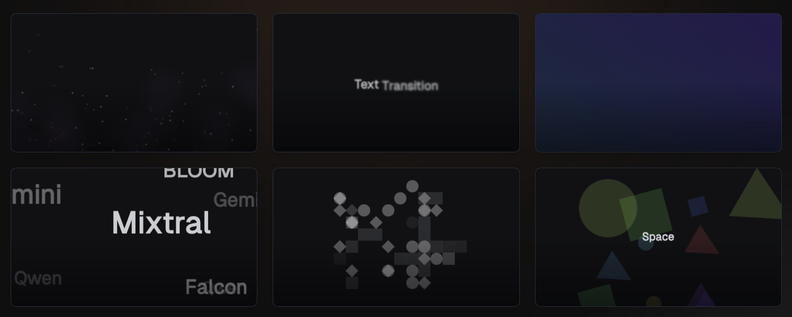

https://github.com/user-attachments/assets/2a5760fe-1886-4490-9c2b-aceec24aff2f



[](https://www.npmjs.com/package/remotion-bits)
[](https://www.npmjs.com/package/remotion-bits)
[](https://github.com/av/remotion-bits/blob/main/LICENSE)
[](https://www.typescriptlang.org/)
[](https://github.com/av/remotion-bits)


Remotion Bits is a comprehensive collection of animation components and utilities designed specifically for [Remotion](https://www.remotion.dev/) video projects. It provides ready-made, composable components for common animation needs: text effects, gradient transitions, particle systems, 3D scenes, and more. It also includes lower-level utilities for advanced motion and color handling.

> [!NOTE]
> This project is not affiliated with or endorsed by the [Remotion](https://www.remotion.dev/) team.

## Installation

```bash
npm install remotion-bits
```

Install the package when you want to consume Remotion Bits components inside a Remotion project. If you want to discover bits, run the MCP server, or pull individual bits into your app, start with the single-step usage paths below.

## Single-Step Usage

All published entry points use the same package name: `remotion-bits`.

### CLI

Use the published CLI directly without installing it first:

```bash
npx remotion-bits find 3d cards
npx remotion-bits fetch bit-fade-in --json
```

Or install the bin globally:

```bash
npm i -g remotion-bits
remotion-bits find 3d cards
remotion-bits fetch bit-fade-in --json
```

### MCP

Start the MCP server on stdio without a prior install:

```bash
npx remotion-bits mcp
```

Or use the global bin:

```bash
remotion-bits mcp
```

Minimal MCP client config:

```json
{
	"command": "npx",
	"args": ["-y", "remotion-bits", "mcp"]
}
```

If you installed the package globally, use:

```json
{
	"command": "remotion-bits",
	"args": ["mcp"]
}
```

The server exposes two tools:

- `find_remotion_bits`
- `fetch_remotion_bit`

### Package

Use the package install when you want to import components and utilities into a Remotion project:

```bash
npm install remotion-bits
```

```tsx
import { AnimatedText, GradientTransition } from 'remotion-bits';
```

### jsrepo

Pull a bit into your project in one step:

```bash
npx jsrepo add --registry https://unpkg.com/remotion-bits/registry.json animated-text
```

Optional init flow if you plan to add multiple items:

```bash
npx jsrepo init https://unpkg.com/remotion-bits/registry.json
npx jsrepo add animated-text
```

### Skill

This repository ships a skill file at `skills/remotion-bits/SKILL.md`.

Use that skill in an agent setup that supports custom skills, then point it at the published Remotion Bits entry points above. The skill does not automatically install anything by itself; it documents the workflow and relies on the MCP or CLI commands shown here.

## Consumer Usage

### Find and fetch published bits

Search by visual goal, tags, and output format:

```bash
npx remotion-bits find "camera presentation" --tag scene-3d --limit 2
npx remotion-bits find "fade in" --limit 1 --json
npx remotion-bits fetch bit-fade-in --json
```

### Install with jsrepo

The registry is published as a jsrepo registry at:

```
https://unpkg.com/remotion-bits/registry.json
```

One-off add without init:

```bash
npx jsrepo add --registry https://unpkg.com/remotion-bits/registry.json animated-text
npx jsrepo add --registry https://unpkg.com/remotion-bits/registry.json particle-system
```

After `jsrepo init`, add components or utilities by name:

```bash
npx jsrepo add animated-text
npx jsrepo add particle-system
npx jsrepo add color
```

### Use as a package in a Remotion project

Install the package if you want to keep using the published components directly instead of copying them into your app:

```bash
npm install remotion-bits
```

You will also need the Remotion peer dependencies in your project: React 18+, React DOM 18+, and Remotion 4+.

## Repo-Local Development

Use the repo-local commands below only when working inside this repository.

Prerequisites:

- Git
- Node.js 18 or newer
- npm that ships with your Node install

Fresh clone bootstrap:

```bash
git clone https://github.com/av/remotion-bits.git
cd remotion-bits
npm install
```

Lookup CLI from the repo root:

```bash
npm run bits:find -- --query "camera presentation" --tag scene-3d --limit 2
npm run bits:find -- --query "fade in" --limit 1 --json
npm run bits:fetch -- bit-fade-in --json
```

MCP server from the repo root:

```bash
npm run mcp:bits
```

Equivalent repo-local client config:

```json
{
	"command": "node",
	"args": ["./node_modules/tsx/dist/cli.mjs", "scripts/remotion-bits-mcp.ts"],
	"cwd": "/absolute/path/to/remotion-bits"
}
```

Use the repo root as `cwd`. The server is stdio-only and should be attached directly, not through `npm run`, so stdout stays reserved for MCP protocol messages.

Reproducible repo-side MCP verification without inventing a separate client:

```bash
npx vitest run scripts/__tests__/remotion-bits-mcp.test.ts
```

That test starts the stdio server, verifies the tool list contains exactly `find_remotion_bits` and `fetch_remotion_bit`, then calls both tools through a real MCP client.

If you want your own MCP client config after verifying the repo flow, use:

```json
{
	"command": "node",
	"args": ["./node_modules/tsx/dist/cli.mjs", "scripts/remotion-bits-mcp.ts"],
	"cwd": "/absolute/path/to/remotion-bits"
}
```

Fallback path when MCP is unavailable:

```bash
npm run bits:find -- --query "camera presentation" --tag scene-3d --limit 2
npm run bits:fetch -- bit-fade-in
```

## Catalog parity and live-source verification

Verify that the docs catalog, CLI lookup, and MCP lookup all use the same shared catalog:

```bash
npx vitest run docs/src/bits/__tests__/catalog.test.ts scripts/__tests__/remotion-bits-lookup.test.ts scripts/__tests__/remotion-bits-mcp.test.ts
```

What this covers:

- docs catalog items, tags, order, and totals are derived from the shared catalog
- CLI `find` and `fetch` return deterministic results from that same catalog
- MCP `find_remotion_bits` and `fetch_remotion_bit` return results from that same catalog

Verify live-source behavior directly from the repo:

```bash
npm run bits:fetch -- bit-fade-in --json
```

The JSON output should include:

- `sourcePath` under `docs/src/bits/examples/...`
- `sourceCode` loaded from that file at runtime

Packaging parity is a separate release concern. If you need to refresh the jsrepo extraction artifact, run:

```bash
npm run registry:extract
```

This updates `extracted-bits.json`. The runtime lookup path used by docs, CLI, and MCP does not depend on that file.

## Contributing

1. Fork the repo and create your branch from `main`.
2. Make changes with clear commit messages.
3. Ensure the build and tests (if any) pass.
4. Open a pull request describing your changes.

## License

MIT
